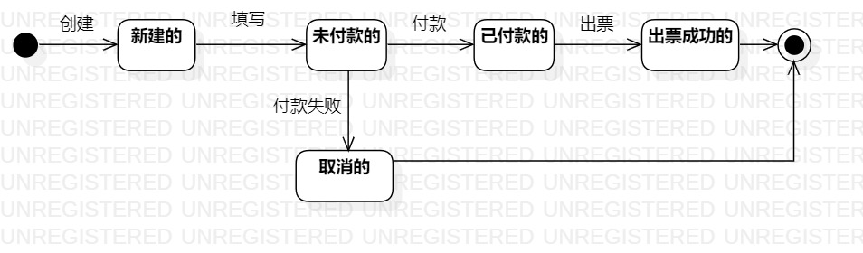

# 实验七   状态建模
## 一、实验目标

1. 掌握对象状态建模（状态图，Statechart）。

## 二、实验内容

1. 寻找一个关键的对象；
2. 设计该对象的关键状态；
3. 对象的状态是：对象所表示的数据。如果数据发生变化，状态就是发生变化。
4. 描述状态：形容词。
5. 订单： 新的（New）、已付款的、取消的、已发货的、已签收的、退货中的、 完成的。
6. 设计状态之间的转变条件。

## 三、实验步骤  

1. 选出一个对象：订单；  
2. 新建状态图：Lab7_StatechartDiagram1；
3. 确定订单对象的关键状态：
（1）新建的；  
（2）未付款的；
（3）已付款的；
（4）出票成功的；
（5）取消的；
4. 确定状态之间的转变条件：

## 四、实验结果

  
图1 订单状态图