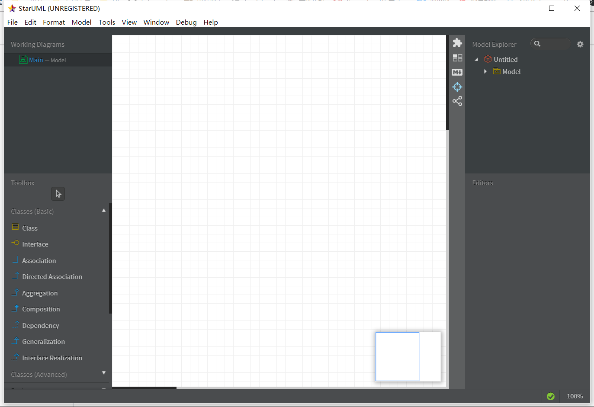
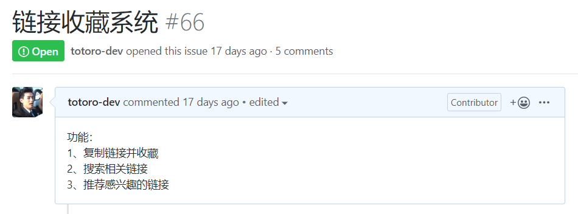

## 1714080902317黄龙淼实验一报告

## 实验内容

1. 下载并安装建模工具 StarUML，下载地址：[http://staruml.io](http://staruml.io/)
2. 确定个人建模选题，将选题填写在 Issues 中：
   https://github.com/hzuapps/uml-modeling-2020/issues

## 实验要求

1. 工具安装之后，打开并截图，保存在实验报告中；
2. 将个人选题及描述写在实验报告中，具体要求：

- 选题标题为软件名称；
- 描述中写出2-3个功能需求（不允许写“注册”和“登录”）；
- 选题功能应该包含数据库的使用。

## 实验结果

### 1、StartUML软件截屏

### 2、创建一个UML图

### 3、创建Issuse：趣链

