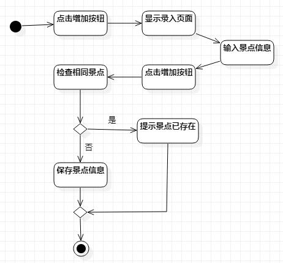
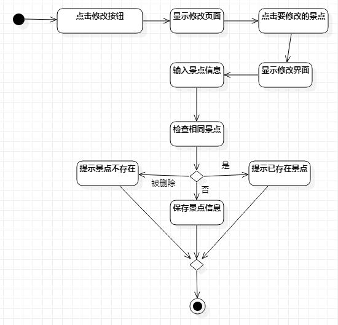
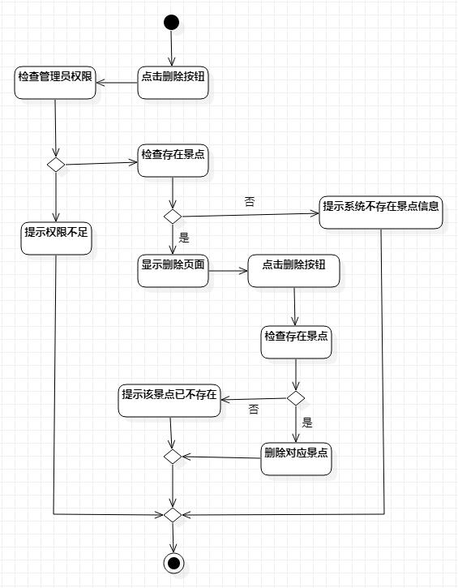

# 实验三：过程建模

## 1. 实验目标

1. 掌握过程建模方法
2. 掌握活动图的画法（Activity Diagram）

## 2. 实验内容

1. 学习过程建模建模的概念
2. 在StarUML上过程建模

## 3. 实验步骤

1. 学习过程建模
2. 确定过程建模要画活动图的用例：增加景点信息、修改景点信息、删除景点信息
3. 在StarUML上用例建模  
    3.1. 把基本流程和扩展流程的动作画为操作（Action）  
    3.2. 在出现分支的操作之后使用决策（Decision）节点
    
## 4. 实验结果

   
图1：旧地狱遗迹旅游导引系统增加景点信息活动图  

   
图2：旧地狱遗迹旅游导引系统修改景点信息活动图  

   
图3：旧地狱遗迹旅游导引系统删除景点信息活动图  
