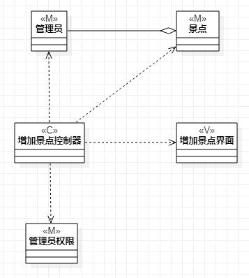
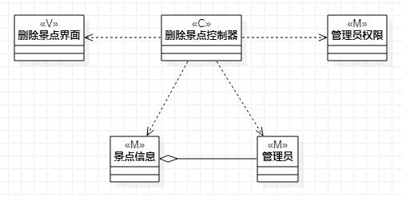

# 实验四、五：类建模

## 1. 实验目标

1. 掌握类建模方法
2. 了解MVC或你熟悉的设计模式
2. 掌握类图的画法（Class Diagram）

## 2. 实验内容

1. 基于MVC模式设计类
2. 设计类的关系
3. 画出类图

## 3. 实验步骤

1. 视频学习类建模与类的五种关系
2. 根据用例规约确定每一个类图要建立的类
3. 在StarUML上基于MVC设计模式进行类建模  
    3.1 创建class  
    3.2 确定class的name和stereotype  
    3.3 建立各个类之间的关系
    
## 4. 实验结果

   
图1：旧地狱遗迹旅游导引系统增加景点信息类图  

   
图2：旧地狱遗迹旅游导引系统修改景点信息类图  

   
图3：旧地狱遗迹旅游导引系统删除景点信息类图  
