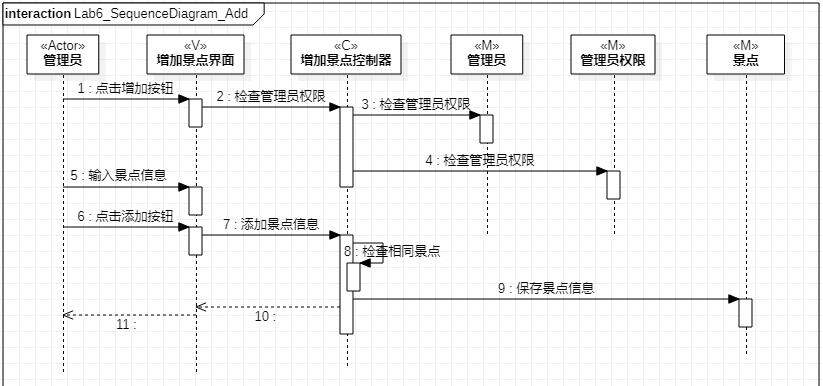
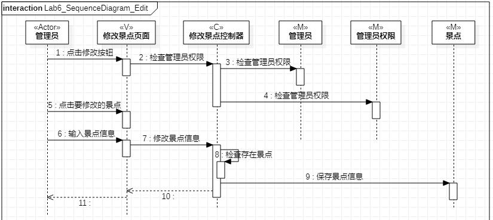
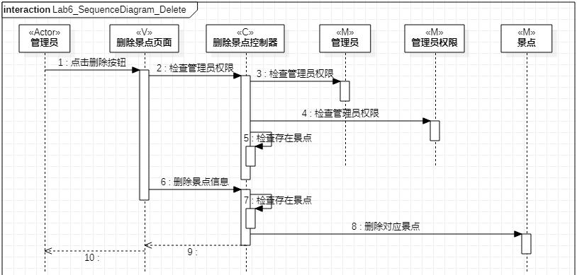

# 实验六：交互建模

## 1. 实验目标

1. 理解系统交互  
2. 掌握UML顺序图的画法  
3. 掌握对象交互的定义与建模方法  

## 2. 实验内容

1. 根据用例模型和类模型，确定功能所涉及的系统对象  
2. 在顺序图上画出参与者（对象）  
3. 在顺序图上画出消息（交互）  

## 3. 实验步骤

1. 视频学习交互建模与顺序图的画法  
2. 根据用例图确定交互建模中要画的三个顺序图  
3. 在StarUML上交互建模  
    3.1 根据用例图确定顺序图的参与者  
    3.2 根据类图确定顺序图的对象  
    3.3 根据用例规约和活动图画出顺序图的消息和交互  
    
## 4. 实验结果

  
图1：旧地狱遗迹旅游导引系统增加景点信息活动图  

  
图2：旧地狱遗迹旅游导引系统增加景点信息顺序图  

  
图3：旧地狱遗迹旅游导引系统修改景点信息活动图  

  
图4：旧地狱遗迹旅游导引系统修改景点信息顺序图  

  
图5：旧地狱遗迹旅游导引系统删除景点信息活动图  

  
图6：旧地狱遗迹旅游导引系统删除景点信息顺序图  
