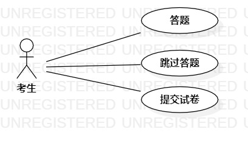

# 实验二：用例建模

## 一、实验目标

1. 细化功能需求
2. 画出用例图（Use Case Diagram）
3. 编写用例规约（表格）

## 二、实验内容

1、创建用例图

2、编写实验报告文档

3、编写用例规约

## 三、实验步骤

1、选题为轻考驾照软件

2、根据issues在StarUML上创建用例图（UseCaseDiagram1.jpg）

3、确定参与者(Actor)

　　－考生

4、确定用例（UseCase）

　　－答题

　　－交卷

５、建立Actor和UseCase的联系

 6、绘制用例图

 7、编写用例规约

## 四、实验结果

　　　　　　　　　　　　　　　　图1：轻考驾照软件用例图

## 表1:答题用例规约

| 用例编号 | UC01                                         | 备注               |
| -------- | :------------------------------------------- | ------------------ |
| 用例名称 | 答题                                         |                    |
| 前置条件 | 考生已进入答题页面                           | 可选               |
| 后置条件 | 系统显示下一道题页面                         | 可选               |
| 基本流程 | 1. 考生点击其中一个选项的按钮(A、B、C、D)    | 用例执行成功的步骤 |
| ~        | 2. 考生点击确定按钮                          |                    |
| ~        | 4. 系统检查考生所选答案不为空，保存考生答案  |                    |
| 扩展流程 | 4.1 系统检查考生所选答案为空，则提示“请选择” | 用例执行失败       |

## 表2:交卷用例规约

| 用例编号 | UC02                                              | 备注               |
| -------- | ------------------------------------------------- | ------------------ |
| 用例名称 | 交卷                                              |                    |
| 前置条件 | 考生已进入答题页面                                | 可选               |
| 后置条件 | 系统进入分数页面                                  | 可选               |
| 基本流程 | 1. 考生点击提交试卷按钮                           | 用例执行成功的步骤 |
| ~        | 2. 系统保存考生信息                               |                    |
| ~        | 3. 系统统计考生答案数量，保存统计结果             |                    |
| ~        | 4. 系统检查已经答完全部50道题，系统提示“提交成功” |                    |
| ~        | 5. 系统匹配答案                                   |                    |
| ~        | 6. 系统保存答对题目的编号                         |                    |
| ~        | 7. 系统计算分数                                   |                    |
| ~        | 8. 系统保存总分                                   |                    |
| ~        | 9. 系统显示总分                                   |                    |
| 扩展流程 | 3.1 系统检查未答完全部50道题，系统提示“提交失败”  | 用例执行失败       |

