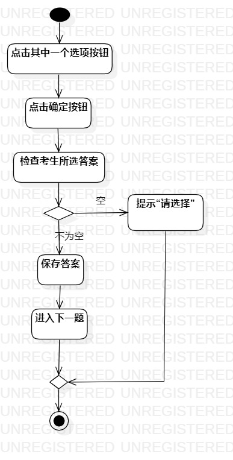
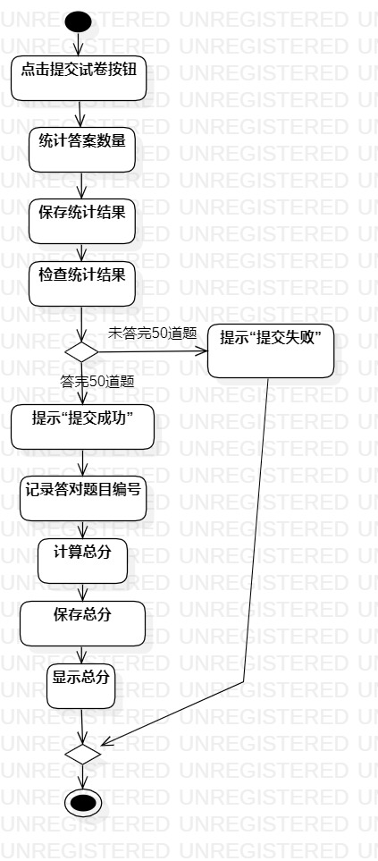

# 实验三：过程建模

## 一、实验目标

1. 掌握过程建模方法
2. 掌握活动图画法（Activity Diagram）

## 二、实验内容

1、创建用例图

2、编写实验报告文档

3、编写用例规约

## 三、实验步骤

1、根据用例规约在StarUML上创建活动图（ActivityDiagram1.jpg、ActivityDiagram2.jpg）

2、绘制活动图

3、导出活动图

4、撰写实验三文档

5、修改实验二文档

## 四、实验结果

​																图1：答题活动图

​																图2：交卷活动图

## 五、实验总结

​		出于让活动图简洁的考虑，修改了实验二交卷用例规约的扩展流程。将系统提示从“未答完50道题，提交失败”改为“提交失败”。虽然之前的提示更加的面向用户，告诉用户是有题目没做才提交失败。但是出于让活动图简洁，缩短了提示。
