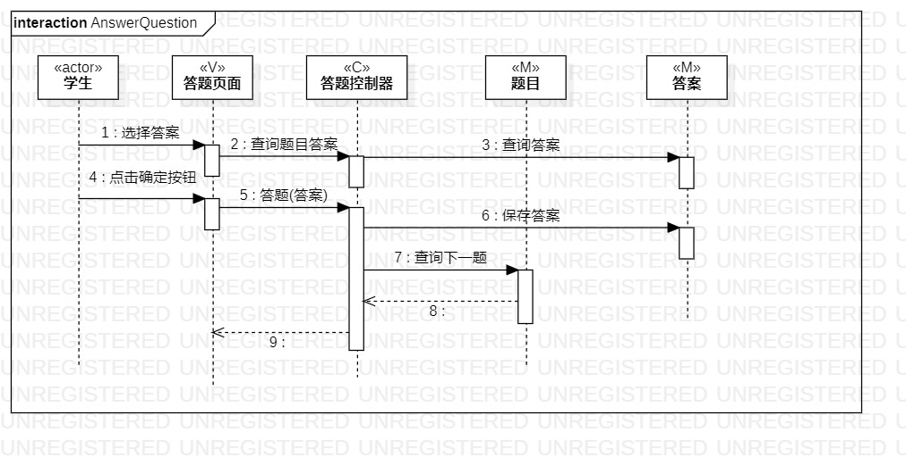
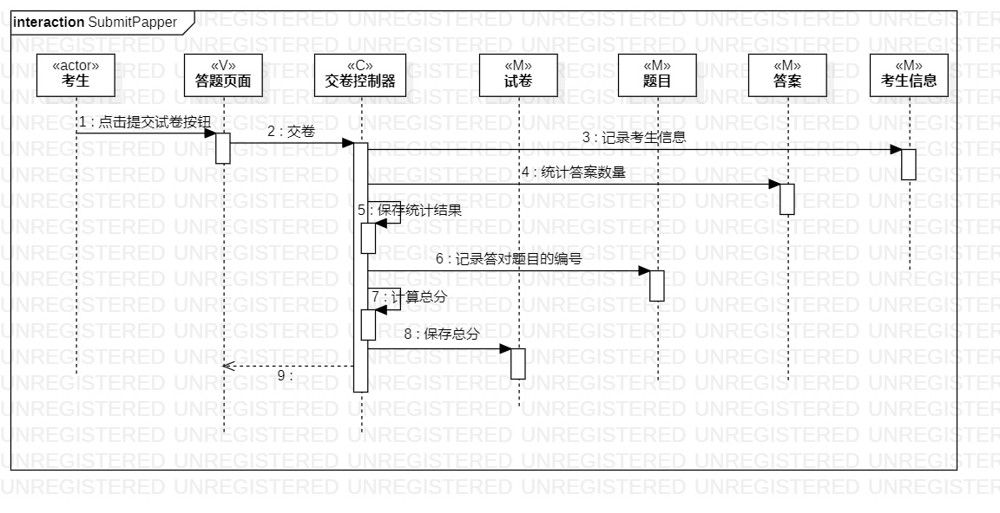

# 实验四：交互建模

## 一、实验目标

1. 理解系统交互
2. 掌握UML顺序图的画法
3. 掌握对象交互的定义与建模方法

## 二、实验内容

1、根据用例模型和类模型，确定功能所涉及的系统对象；

2、在顺序图上画出参与者（对象）

3、在顺序图上画出消息（交互）

## 三、实验步骤

1、在StarUML上创建顺序图

2、根据用例规约和类图，画出1+N个参与者

3、绘制答题顺序图

4、绘制交卷顺序图

5、撰写实验六文档

## 四、实验结果

​																图1：答题顺序图

​																图2：交卷顺序图

## 实验总结

整个交卷过程未访问题目中的问题所以将问题去掉了。此次实验修改了实验二、实验三和实验四五。再次细化了交卷用例规约。