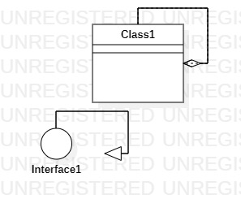

# 实验一

## 1.实验目标
 
1.熟悉github的使用  
2.安装和学习StarUML的基础使用 
 
## 2.实验内容
 1.熟悉使用github提交作业  
 2.安装并学习StarUML的使用 

## 3.实验步骤
 1.下载并安装git工具还有StarUML软件  
 2.在github上fork老师的项目到自己的账号下  
 3.clone项目到本机  
 4.在本地文件夹中建一个自己学号命名的文件夹  
 5.创建实验一文档Markdown文档，并用StarUML创建一张UML图  
 6.将UML图插入到实验一Markdown文档中  
 7.用git上传文件夹到自己fork的项目下  
 8.在github上使用pull request请求合并到主库  

## 实验结果

