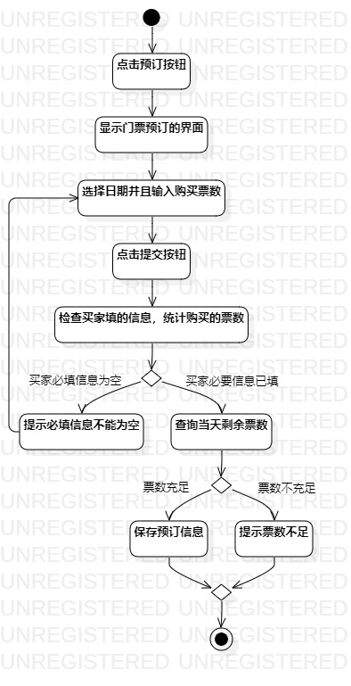
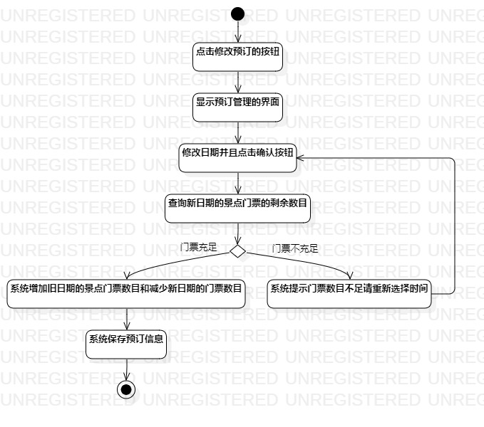

## 1. 实验目标
 1.掌握过程建模方法
 
 2.掌握活动图的画法

## 2. 实验内容
 1.利用StarUML画出活动图
 
 2.熟悉活动图符号的用法和意义
 
 3.编写实验报告
## 3. 实验步骤
  1. 观看教学视频进行学习
  2. 查看用例规范并检查是否需要更改语义
  3. 根据添加预订用例规约画出用例的活动图
  4. 根据修改预订日期用例规约画出用例的活动图 
  5. 编写实验报告
  
## 4. 实验结果

 

图1：添加预订活动图

图2：修改预订日期活动图
