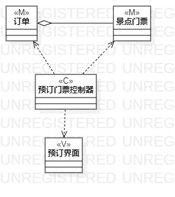
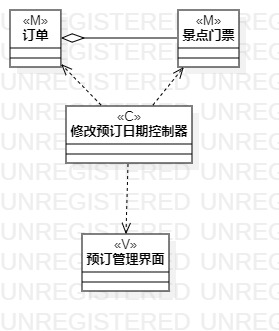

# 实验四五：类建模

## 1. 实验目标
 1.掌握类建模方法
 2.设计类的关系
 3.画出类图
 4.理解类的五种关系
 5.掌握类之间的关系画法

## 2. 实验内容
 1.基于MVC模式设计类
 2.设计类的关系
 3.画出类图
 
## 3. 实验步骤
  1. 观看教学视频进行学习
  2. 根据添加预订的用例规约画出用例的类图（画出买家账号，游客，订单和景点门票的类，画出添加预订控制器，画出预订管理界面和填写游客信息界面）
  3. 根据修改预订日期的用例规约画出用例的类图（画出买家账号，游客，订单和景点门票的类，画出修改预订日期控制器，画出预订管理界面和填写游客信息界面）
  4. 编写实验报告 
 
## 4. 实验结果

 

图1：预订门票类图

图2：修改预订日期类图
