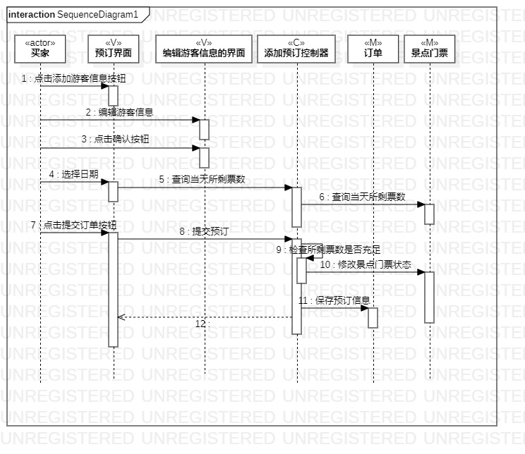
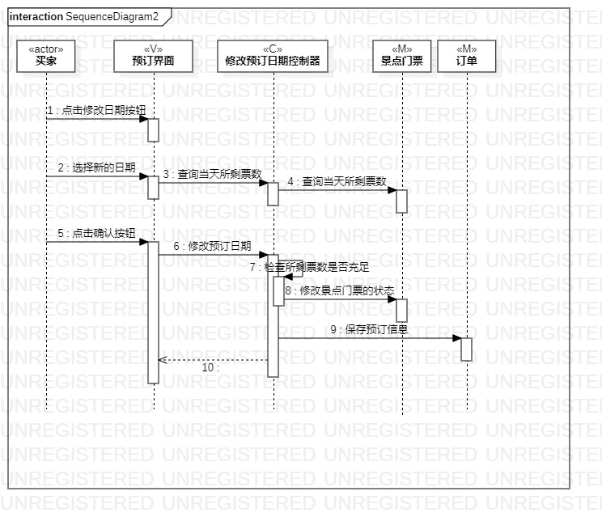

## 1. 实验目标
  1.理解系统交互；
  
  2.掌握UML顺序图的画法；
  
  3.掌握对象交互的定义与建模方法。

## 2. 实验内容
  1.根据用例模型和类模型，确定功能所涉及的系统对象；
  
  2.在顺序图上画出参与者（对象）；
  
  3.在顺序图上画出消息（交互）。
 
## 3. 实验步骤
  1. 观看教学视频进行学习
  
  2. 画出添加预订顺序图
  
  3. 画出修改预订日期顺序图
  
  4. 编写实验报告
  
  
## 4. 实验结果

 

图1：添加预订顺序图

图2：修改预订日期顺序图
 
