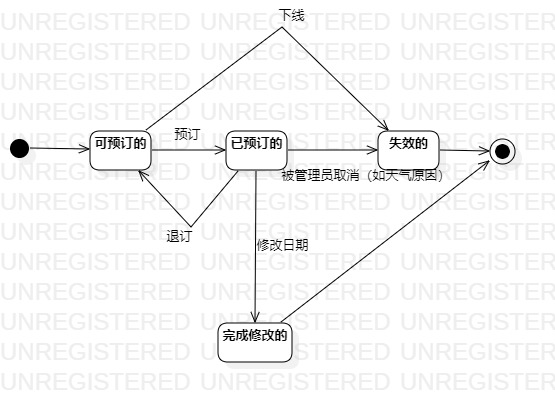

## 1. 实验目标
 1.掌握对象状态建模（状态图，Statechart）。

## 2. 实验内容
 1.根据前面所有的实验确定状态图对象； 
 
 2.确定这个对象的所有状态；
 
 3.画出状态之间的转变条件。
## 3. 实验步骤
  1. 观看教学视频进行学习；
  2. 从本系统中找出一个关键对象，即景点门票；
  3. 设计景点门票的关键状态：
     可预订的；
     已预定的；
     失效的；
     完成修改的；
  4. 用StarUML画出该对象的状态图（StatechartDiagram）
  5. 编写实验报告
  
## 4. 实验结果

 

图1：状态图
