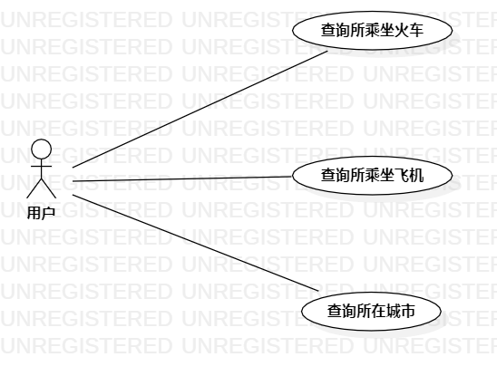

# 实验二：用例建模

## 1、实验目标
- 学会使用Markdown编写实验报告

- 学会用例建模

- 学会编写用例规约

## 2、实验内容
- 选择建模主题

- 画用例图

- 编写用例规约

## 3、实验步骤
- 在issues提交建模主题

- 在StarUML画用例图

- 编写用例规约

- 编写实验报告

## 4、实验结果

图1.患者同乘查询系统的用例图

### 表1：查询所乘坐火车用例规约  

用例编号  | query01 | 备注  
-|:-|-  
用例名称  | 查询所乘坐火车 |   
前置条件  | 用户登入查询系统 |
后置条件  |      | 
基本流程  | 1.用户点击『查询所乘坐火车』按钮；  |  
~| 2.系统显示查询页面；  |   
~| 3.用户输入火车票编号,点击查询按钮；  |   
~| 4.系统到火车票编号存在；  |
~| 5.系统查询到火车上有同乘确诊患者； |   
~| 6.系统显示查询结果。  |  
扩展流程  | 4.1 系统检查火车票编号不存在，提示“火车票编号不存在，请重新输入”；| 
~| 5.1 系统检查发现没有同乘确诊患者。 |  

### 表2：查询所乘坐飞机用例规约  

用例编号  | query02 | 备注  
-|:-|-  
用例名称  | 查询所乘坐飞机 |   
前置条件  | 用户登入查询系统 | 
后置条件  |      |  
基本流程  | 1.用户点击『查询所乘坐飞机』按钮；  |
~| 2.系统显示查询页面；  |   
~| 3.用户输入航班号,点击查询按钮；| 
~| 4.系统检查到航班号存在；  |
~| 5.系统查询到飞机上有同乘确诊患者； |   
~| 6.系统显示查询结果。 |  
扩展流程  | 4.1 系统检查发现航班号不存在，提示“航班号不存在，请重新输入”；|   
~| 5.1 系统检查发现没有同乘确诊患者。 |  

### 表3：查询所在城市用例规约  

用例编号  | query03 | 备注  
-|:-|-  
用例名称  | 查询所在城市 |   
前置条件  | 用户登入查询系统 | 
后置条件  |      |  
基本流程  | 1.用户点击『查询所在城市』按钮；  | 
~| 2.系统显示查询页面；  |   
~| 3.用户输入城市,点击查询按钮；  |   
~| 4.系统查询到有确诊患者途径的火车站等公共场所； |   
~| 5.系统显示查询结果。  |  
扩展流程  |  4.1 系统检查发现没有确诊患者途径的公共场所。|
