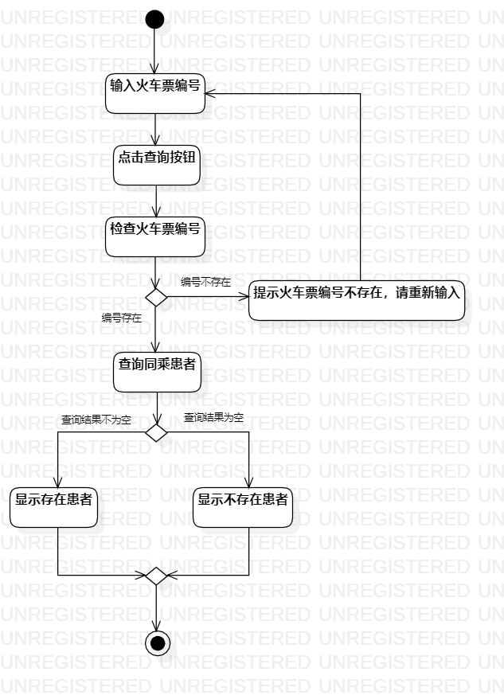
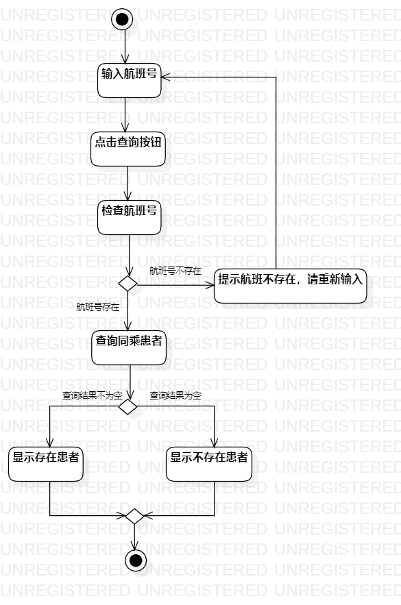
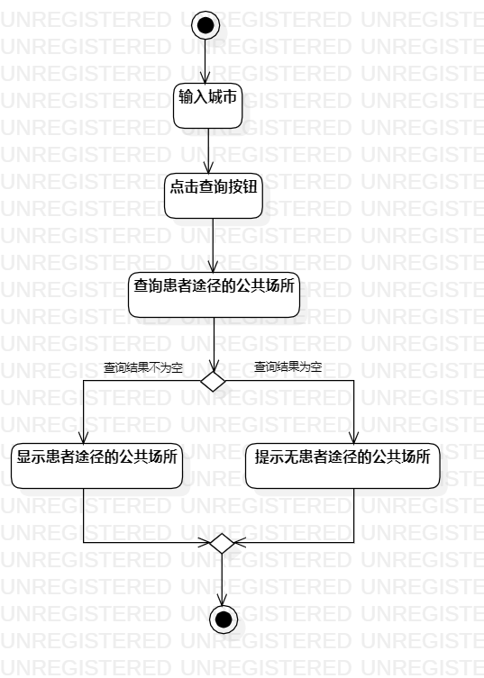

# 实验三 

## 1.实验目标
- 掌握过程建模方法；
- 掌握活动图的画法。（Activity Diagram）

## 2.实验内容
- 根据自己的用例规约在StarUML画活动图

## 3.实验步骤
- 新建3个活动图，命名分别对应用例规约
- 添加开始节点
- 根据各用例规约添加对应的动作和决策点
- 添加结束节点
- 完成连线
- 保存活动图并导出为图片

## 4.实验结果

图1.查询所乘坐火车的活动图

图2.查询所乘坐飞机的活动图

图3.查询所在城市的活动图

