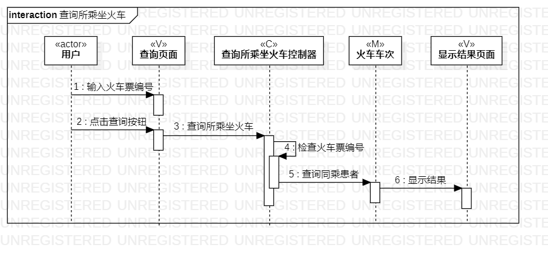
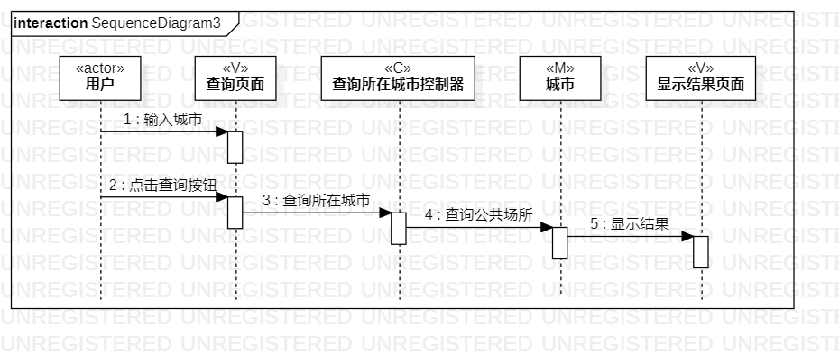

# 实验六：交互建模

## 1、实验目标
- 理解系统交互；
- 掌握UML顺序图的画法；
- 掌握对象交互的定义与建模方法。

## 2、实验内容
- 根据用例模型和类模型，确定功能所涉及的系统对象；
- 在顺序图上画出参与者（对象）；
- 在顺序图上画出消息（交互）。

## 3、实验步骤
- 观看老师发布的视频，学习顺序图的画法；
- 在StarUML上创建顺序图；
- 根据活动图以及类图画出顺序图；
- 保存导出为图片；
- 编写实验报告

## 4、实验结果

图1.查询所乘坐火车的顺序图

图2.查询所乘坐火车的顺序图

图3.查询所乘坐火车的顺序图