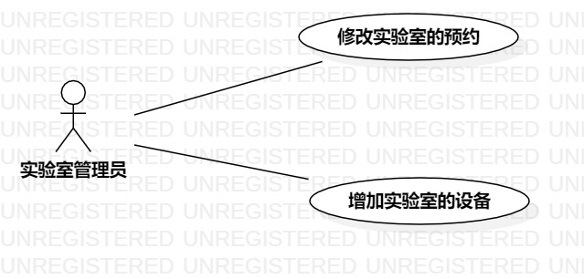

# 实验二 用例建模

## 一、实验目标

1.在issue上创建题目

2.会使用StarUML画图

## 二、实验内容

1. 想一个题目和需要实现的功能 

2. 将题目创建在issue上 

3. 使用StarUML画一个图 

4. 画用例表 

## 三、实验步骤

1. 在issue上创建实验室管理系统题目

2. 确定参与者和用例。

- 参与者：实验室管理员

- 用例：（1） 修改实验室预约 （2） 添加实验室设备

3. 根据关系在UML上画图（model2）

4. 根据关系画用例表

## 四、实验结果

图1:实验室管理系统的用例图

# 用例规约的编写

## 表1：修改实验室预约用例规约  

用例编号  | UC01 | 备注  
-|:-|-  
用例名称  | 修改实验室预约  |   
前置条件  | 系统已登录进入实验室管理界面     | *可选*   
后置条件  | 管理员进入实验室管理界面     | *可选*   
基本流程  | 1.管理员点击实验室预约管理界面  |*用例执行成功的步骤*    
~| 2.系统查询实验室预约情况，系统显示实验室预约管理界面  |   
~| 3.管理员选择一条实验室预约，点击后面的修改按钮   |   
~| 4.系统搜索到该条实验室预约，系统显示修改界面   |   
~| 5.管理员输入修改内容，点击修改按钮   |  
~| 6.系统修改该条预约，系统显示实验室预约管理界面   |  
扩展流程  | 6.1 系统检查发现修改的日期为空，系统显示“修改日期不能为空！” |*用例执行失败*   
~| 6.2 系统检查发现修改的日期与其他预约相冲突，系统显示“修改不成功！”|

## 表2：添加实验室设备用例规约  

用例编号  | UC01 | 备注  
-|:-|-  
用例名称  | 添加实验室设备 |   
前置条件  | 系统已登陆进入实验室管理界面     | *可选*   
后置条件  | 管理员进入实验室管理界面    | *可选*   
基本流程  | 1.管理员点击实验室设备添加界面  |*用例执行成功的步骤*    
~| 2.系统显示实验室设备添加界面  |   
~| 3.管理员输入设备名，设备规格，设备单价，设备购买时间，设备总数，点击添加按钮  |   
~| 4.系统检查设备名，设备规格，设备单价，设备购买时间，设备总数不为空 |     
~| 5.系统检查设备无冲突，系统添加设备，系统显示设备信息界面  | 
扩展流程  | 4.1 系统检查设备名、设备规格、设备单价、设备购买时间、设备总数有一或多项为空，系统显示“系统信息不能为空”  |*用例执行失败* 
~| 5.1 系统检查设备名已存在，系统显示“设备已存在！添加设备不成功！”|

