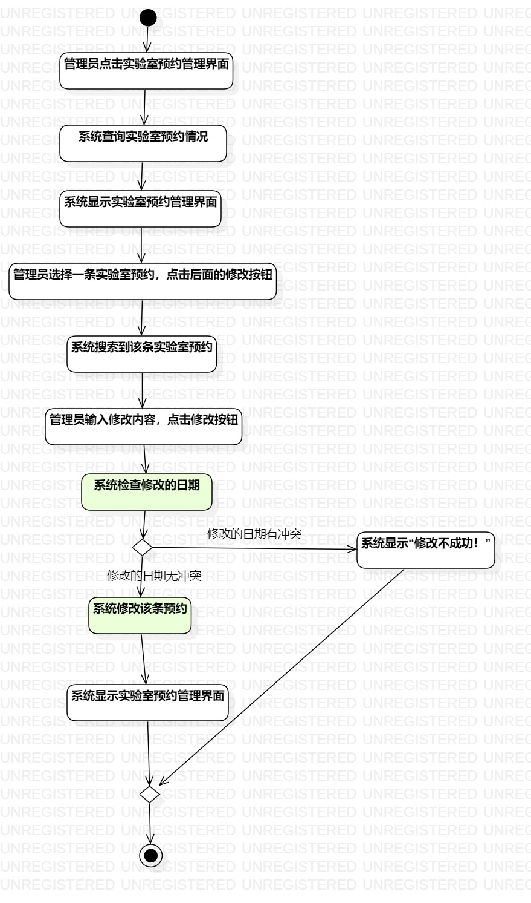
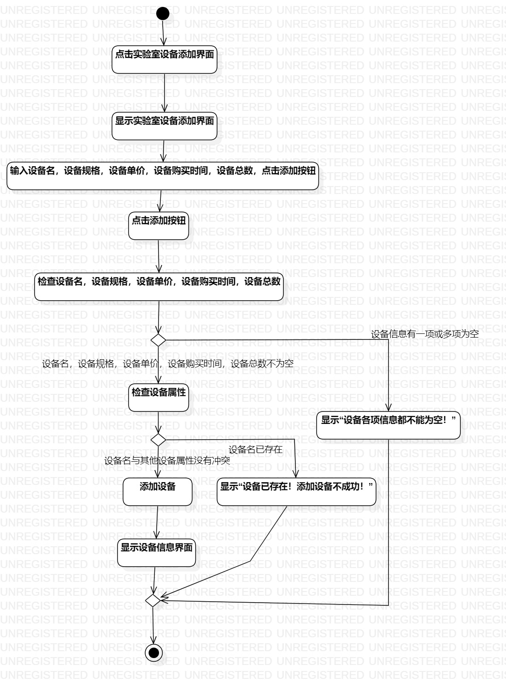

# 实验三

## 一、实验目标

1.掌握过程建模方法；

2.掌握活动图的画法。（Activity Diagram）

## 二、实验内容

1.在StarUML创建修改实验室预约图

2.在StarUML创建添加实验室设备图

## 三、实验步骤

1.在StarUML创建并制作“修改实验室预约.jpg”

2.在StarUML创建并制作“添加实验室设备.jpg”

## 四、实验结果

1.画图

图1.在StarUML上创建的修改实验室预约图

图2.在StarUML上创建的添加实验室设备图
