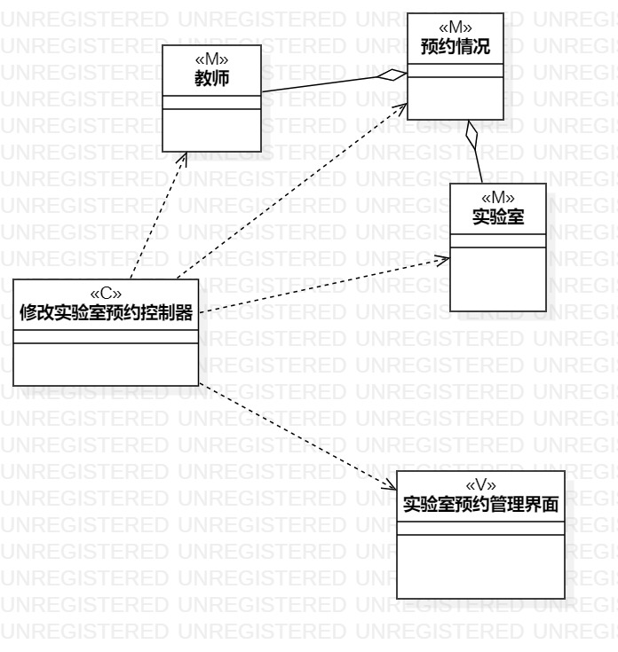
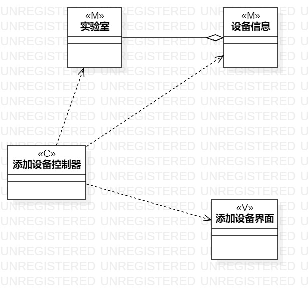

# 实验四、五

## 一、实验目标

1.掌握类建模方法；

2.了解MVC或你熟悉的设计模式；

3.掌握类图的画法。（Class Diagram）

## 二、实验内容

1.基于MVC模式设计类；

2.设计类的关系；

3.画出类图。

## 三、实验步骤

1.观看视频，检查实验二，三，做出对应的小修改

2.通过学习老师发布的视频，查看自己的用例表，分析所需要的类

3.在StarUML画出修改实验室预约，添加实验室设备类图

4.观看老师发布的关于实验4，5问题视频反复检查，无误后提交

## 四、实验结果

1.修改实验室类图

图1.修改实验室预约类图

2.添加实验室设备类图

图2.添加实验室设备类图
