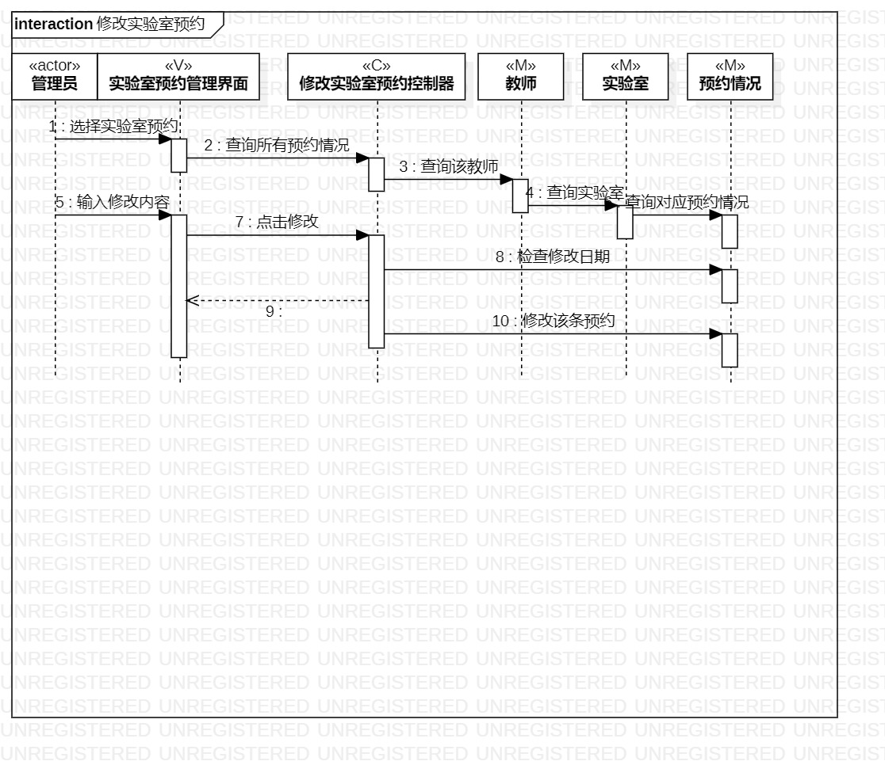
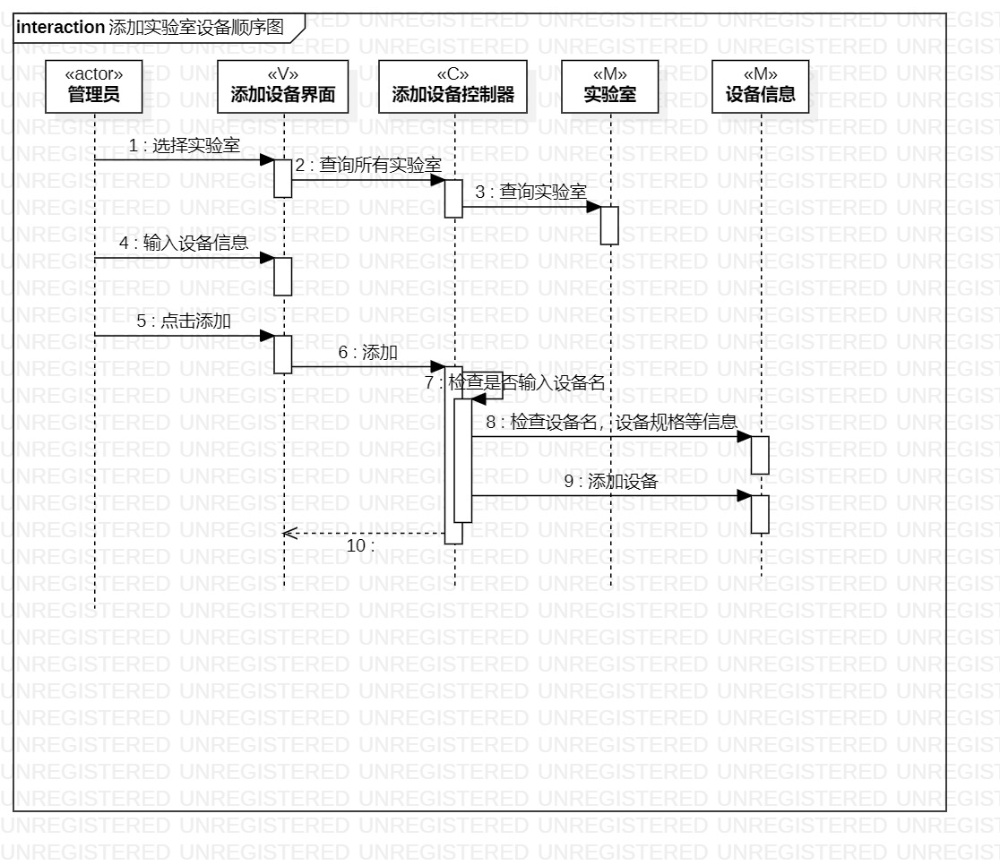

# 实验六

## 一、实验目标

1.理解系统交互；

2.掌握UML顺序图的画法；

3.掌握对象交互的定义与建模方法

## 二、实验内容

1.根据用例模型和类模型，确定功能所涉及的系统对象；

2.在顺序图上画出参与者（对象）；

3.在顺序图上画出消息（交互）。

## 三、实验步骤

1.根据用例模型和类模型，确定功能所涉及的系统对象；

2.在顺序图上画出参与者（对象）；

3.在顺序图上画出消息（交互）。

4.反复检查是否符合要求。

## 四、实验结果

1.修改实验室预约顺序图

图1.修改实验室预约顺序图

2.添加实验室设备顺序图

图2.添加实验室设备顺序图

