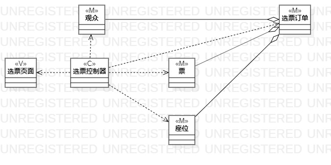
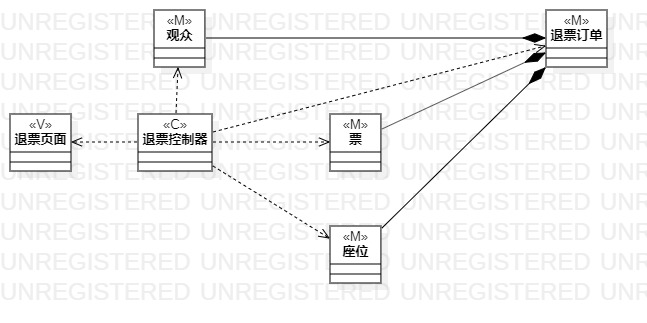

# 实验四五：类建模 
## 实验目标
1. 掌握类建模方法  
2. 了解MVC或你熟悉的设计模式  
3. 掌握类图的画法。（Class Diagram）  
## 实验内容
1. 基于MVC模式设计类
2. 设计类的关系
3. 画出类图
## 实验步骤
1. 确定设计的模式： MVC 设计模式
2. 查看用例规约，分析用例的类、控制器和界面
3. 确定类之间的关系
## 实验结果
选票类图    
  
退票类图    
  
改票类图    

## 画图要点
1. 从用例规约中的基本流程和扩展流程中寻找类
2. 给系统操作设计业务服务类
3. 有多少个用例，画多少个类图
