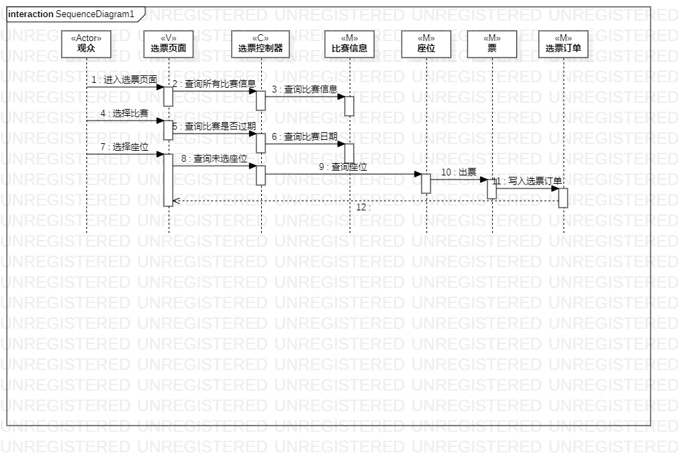
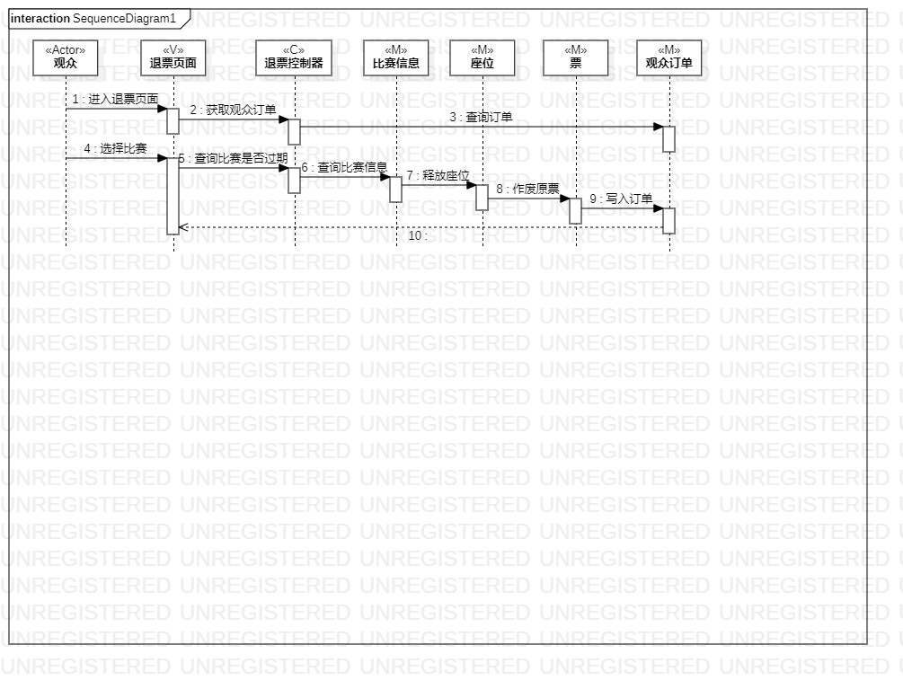
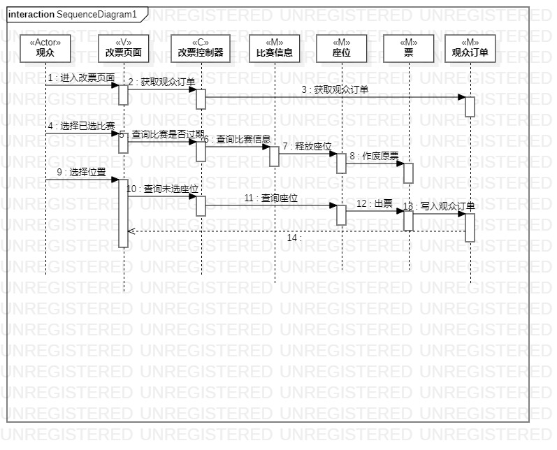

# 实验六：交互建模
## 实验目标  
1.理解系统交互；  
2.掌握UML顺序图的画法；  
3.掌握对象交互的定义与建模方法。  
## 实验内容
1.根据用例模型和类模型，确定功能所涉及的系统对象；  
2.在顺序图上画出参与者（对象）；  
3.在顺序图上画出消息（交互）。  
## 实验步骤
1.画出actor，将类图中的各个类按合适的顺序排列在同一行；      
2.根据活动图，将各个步骤与各个类串联起来；     
3.通过交互建模，发现类图与活动图中存在的问题，并进行修改。    
## 实验结果
选票交互建模      
    
退票交互建模     
    
改票交互建模   
  

