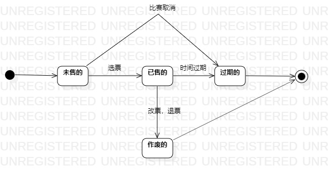

## 实验目标
1. 掌握对象状态建模（状态图，Statechart）。  
## 实验内容
1. 寻找对象  
2. 寻找对象状态  
3. 找出状态之间的转换条件  
画出类图
## 实验步骤
1. 寻找一个关键的对象；  
2. 设计该对象的关键状态；  
    *对象的状态是：对象所表示的数据。如果数据发生变化，状态就是发生变化。  
    *描述状态：形容词。  
    *票： 未售的、已售的、过期的。  
3. 设计状态之间的转变条件。
## 实验结果
状态活动图:  
 
  
