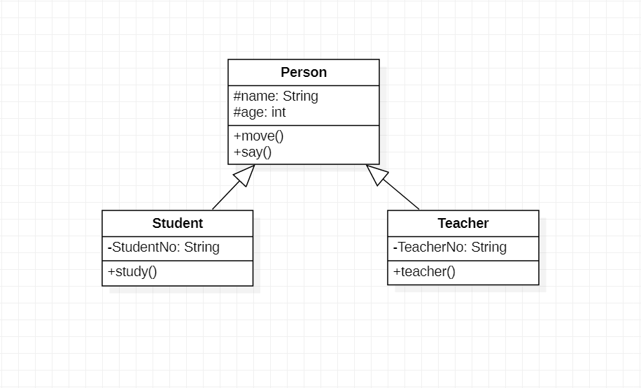

# 实验一

## 一、实验目标

1. 熟悉GitHub实验过程
2. 安装与使用StarUML

## 二、实验内容

1. 安装GitHub并联系使用Git Bash
2. 安装StarUML并创建一个图

## 三、实验步骤

1. 下载并安装Git和StarUML
2. fork项目到个人仓库，并clone到本地磁盘
3. 创建.md实验文档，用StarUML建立一个UML图，截图或导出项目图片
4. 使用Git push到个人仓库
5. 在GitHub上编辑实验文档，插入UML图
6. git pull同步操作到本地磁盘上的仓库
7. pull request请求合并到主仓库

## 四、实验结果

