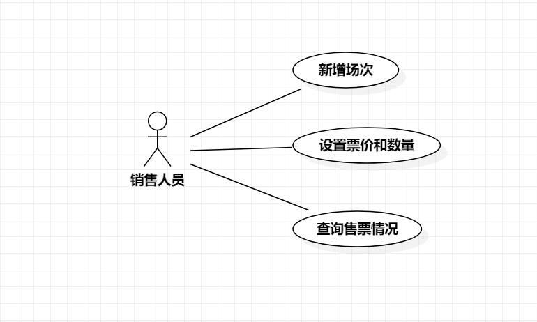

# 实验二：用例建模

## 一、实验目的

1. 使用Markdown编写报告
2. 细化选题
3. 学习使用StarUML用例建模

## 二、实验内容  

1. 创建用例图
2. 编写实验报告文档
3. 编写用例规约

## 三、实验步骤  

1. 选题为演唱会售票系统
2. 根据选题在StarUML上创建用例图（UseCaseDiagram ）
3. 确定参与者（Actor）
   - 销售人员
4. 确定用例（UseCase）
   - 新增场次
   - 设置票价和数量
   - 查询售票情况
5. 建立Actor和UserCase之间的联系
6. 编写用例规约

## 四、实验结果  

1. 画图  
  
图1:演唱会售票系统的用例图

## 表1：新增场次用例规约  

用例编号  | UC01 | 备注  
-|:-|-  
用例名称  | 新增场次  |   
前置条件  | 销售人员登陆进入演唱会售票系统   | *可选*   
后置条件  |      | *可选*   
基本流程  | 1. 销售人员点击新增场次按钮；  |*用例执行成功的步骤*    
~| 2. 系统显示新增场次页面；  |   
~| 3. 销售人员输入歌手姓名、时间、场地，点击添加按钮；  |   
~| 4. 系统查询场次信息，检查该歌手当天无场次安排，检查使用场地当天无场次安排，保存新增场次信息；  | 
~| 5. 系统提示演唱会新增场次成功。
扩展流程  | 4.1 系统检查发现该歌手当天已有安排，提示销售人员"歌手时间冲突"； |*用例执行失败*    
~| 4.2 系统检查发现该场地当天已有安排，提示销售人员"场地使用冲突"。 |

## 表2：设置票价和数量用例规约  

用例编号  | UC02 | 备注  
-|:-|-  
用例名称  | 设置票价和数量  |   
前置条件  | 销售人员新增演唱会场次成功  | *可选*   
后置条件  |    | *可选*   
基本流程  | 1. 销售人员点击设置票价和数量按钮；  |*用例执行成功的步骤*    
~| 2. 系统显示票价和数量框；  |   
~| 3. 销售人员依次输入票价和对应的数量，点击确定按钮；  |   
~| 4. 系统查询场地信息，检查当前设置票券的总数量小于该场地容纳人数，保存票价与数量信息；  |   
~| 5. 系统提示设置成功。  |   
扩展流程  | 4.1 系统检查发现当前设置票券的总数量大于该场地容纳人数，提示销售人员"座位不足"。 |*用例执行失败*   

## 表3：查询售票情况用例规约  

用例编号  | UC03 | 备注  
-|:-|-  
用例名称  | 查询售票情况  |   
前置条件  | 销售人员登陆进入演唱会售票系统  | *可选*   
后置条件  | | *可选*   
基本流程  | 1. 销售人员点击查询按钮；  |*用例执行成功的步骤*    
~| 2. 系统显示演唱会查询页面；  |   
~| 3. 销售人员输入歌手姓名、选择时间，点击查询按钮；  |   
~| 4. 系统检查歌手姓名不为空，查询场次信息，显示当前演唱会页面。  | 
~| 5. 销售人员点击售票情况按钮；  |
~| 6. 系统显示售票情况页面。   |
扩展流程  | 4.1 系统检查发现歌手姓名为空，提示销售人员"歌手姓名不能为空"。 |*用例执行失败*    
