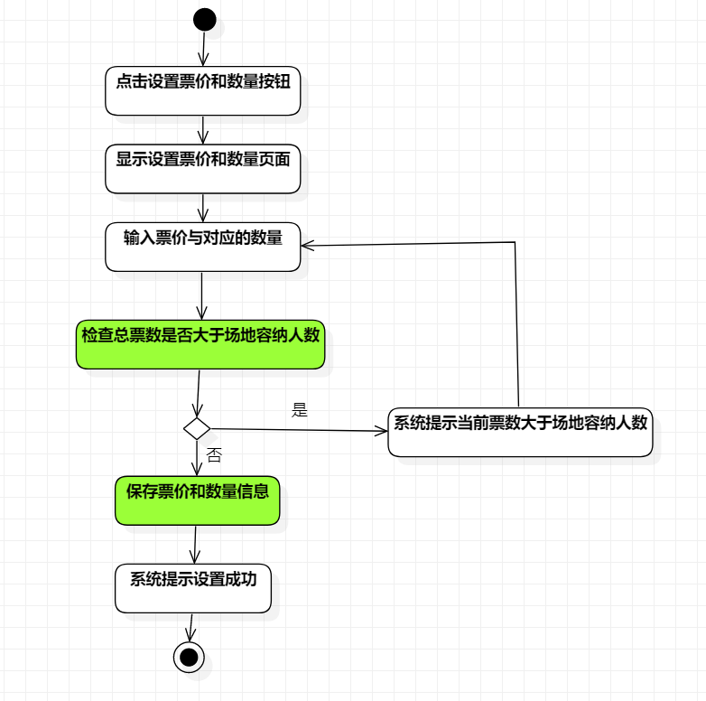
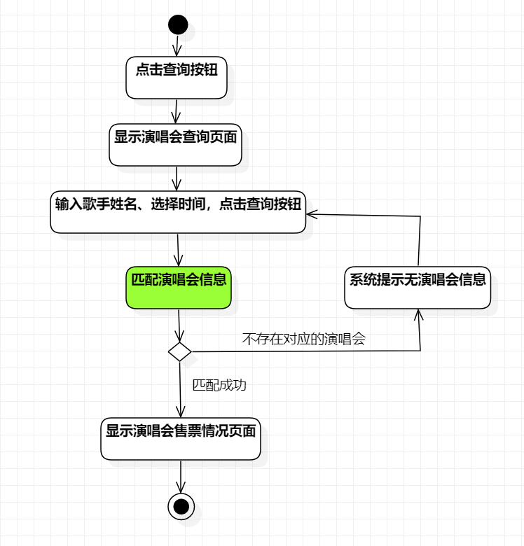

# 实验三：过程建模

## 一、实验目标

1. 掌握过程建模方法
2. 掌握活动图的画法（Activity Diagram）

## 二、实验内容

1. 利用StarUML画出活动图
2. 熟悉活动图符号的用法和意义
3. 编写实验报告

## 三、实验步骤

1. 创建活动图：新增场次、设置票价和数量、查询售票情况
2. 查看实验二用例规约
3. 根据用例规约画出用例的活动图
4. 编写实验报告

## 四、实验结果

  
图1：新增场次的活动图

  
图2：设置票价和数量的活动图

  
图3：查询售票情况的活动图

## 五、实验总结
1. 实验前要对本地库进行git pull进行同步修改
2. 使用不用的颜色标出系统的重点动作（Action）
3. 活动图不要出现交叉的连线，尽可能保持美观。
