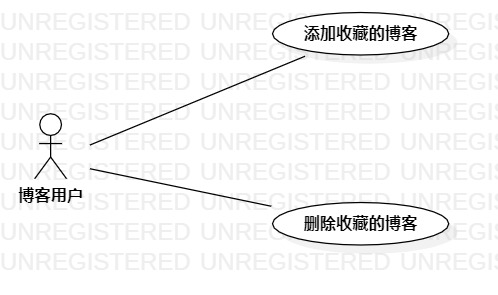

# 实验二：用例建模

## 一、实验目标

1.学会使用Markown编写实验报告

2.掌握用例建模

3.学会编写用例规约

## 二、实验内容

1.将个人选题提交到Issue

2.用StarlUml完成用例建模

3.编写用例规约

## 三、实验步骤

1.提交个人选题：聊天转账系统

2.确定参与者:

  - 用户

3.确定实例:

  - 聊天
  - 转账

4.建立参与者与用户之间的联系

5.编写用例规约

## 四、实验结果

图1：聊天转账系统的用例图

## 五、用例规约
### 表1：聊天用例规约  

用例编号  | UC01 | 备注  
-|:-|-  
用例名称  | 聊天 |   
前置条件  | 用户已登录 |    
后置条件  |  |    
基本流程  | 1. 用户点击聊天对象按钮 |  用例执行成功步骤  
~| 2. 系统显示聊天编辑页面 |
~| 3. 用户输入内容，点击发送 |   
~| 4. 系统检查内容不为空且聊天对象没删除当前用户，发送内容 |
~| 5. 系统保存发送的内容 |
~| 6. 页面显示发送的内容 |
扩展流程  | 4.1 系统检查内容为空，提示“不能发送空白信息” | 用例执行失败
~| 4.2 系统检查聊天对象把当前用户删除，提示“对方已把你删除，请先添加好友” |

### 表2：转账用例规约  

用例编号  | UC02 | 备注  
-|:-|-  
用例名称  | 转账 |   
前置条件  | 用户已登录 |    
后置条件  |  |    
基本流程  | 1. 用户点击聊天对象按钮 |  用例执行成功步骤  
~| 2. 系统显示聊天编辑页面 |
~| 3. 用户点击转账按钮，输入金额并发送 |  
~| 4. 系统检查输入金额不为空且0<金额<200000 |
~| 5. 系统检查聊天对象没删除当前用户 |
~| 6. 系统更新用户的金额 |
~| 7. 系统保存发送的金额信息 |
~| 8. 页面显示本次转账的信息 |
扩展流程  | 4.1 系统检查发现用户输入金额为空，提示“输入金额不能为空” | 用例执行失败
~| 4.2 系统检查发现金额大于200000或小于等于0，提示“转账金额需在0~200000之间” |
~| 5.1 系统检查发现聊天对象把当前用户删除，提示“对方已把你删除，请先添加好友” |
