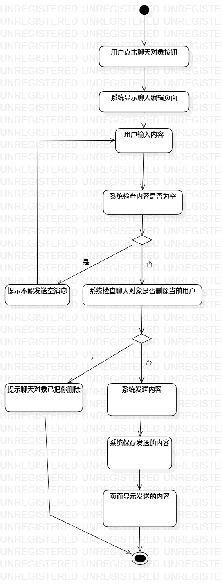

# 实验三：过程建模

## 一、实验目标

1、掌握过程建模方法  
2、掌握活动图的画法（Activity Diagram）  

## 二、实验内容

1、依据实验二的用例规约画出对应的活动图  
2、完成实验三的报告  

## 三、实验步骤

1、用Initial和Final表示开头与结尾  
2、依据实验二的用例规约的基本流程和扩展流程添加Action和Decision  
3、使用Control Flow把各个Action和Decision连接起来  
4、调整各个活动图至规整  

## 四、实验结果

    
图1.聊天的活动图  
    
图2.转账的活动图  
