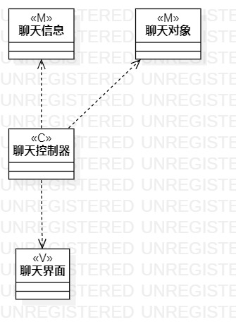
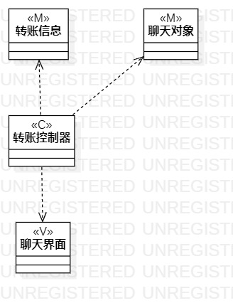

# 实验四：类建模 & 实验五：高级类建模

## 一、实验目标

1. 掌握类建模方法；
2. 了解MVC或你熟悉的设计模式；
3. 掌握类图的画法；
4. 理解类的5种关系；
5. 掌握类之间关系的画法。

## 二、实验内容

1. 基于MVC模式设计类；
2. 设计类的关系；
3. 画出类图。

## 三、实验步骤

1. 根据MVC模式和用例规约，先找数据，再找视图，最后找控制器，确定各层包含哪些类
2. 在StarUML中制作类图

## 四、实验结果

图1：聊天类图

图2：转账类图

## 五、实验总结

1. 有多少个用例，就有多少个类图
2. 建立类关系，越弱越好，其好处是低耦合，方便维护 
3. 数据层和视图层不能通信，用例规约涉及到系统的就是控制器
