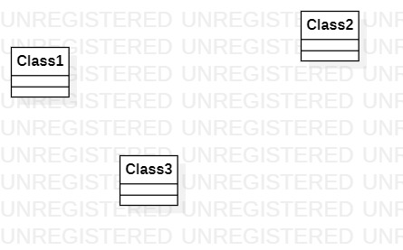

# 实验一

## 一、实验目标

1. 熟悉GitHub实验过程  
2. 安装与使用StarUML

## 二、实验内容

1. 安装GitHub并练习使用Git Bash  
2. 安装StarUML并创建一个图

## 三、实验步骤

1. 学习实验视频
2. 动手操作学习git bash
3. 使用StarUML画图
4. 提交实验报告

## 四、实验结果

1. 画图

  
图1.在StarUML上创建第一个图
