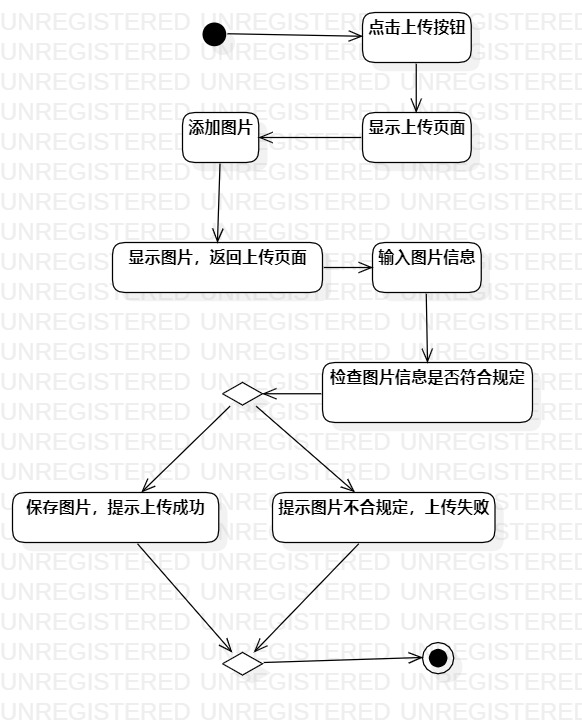
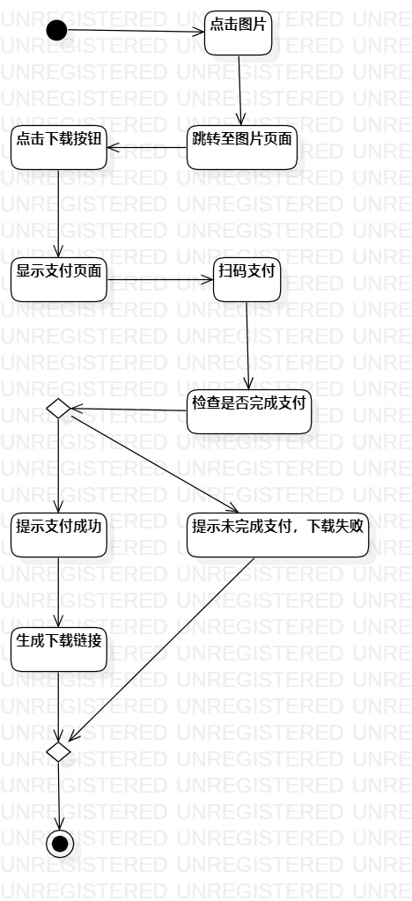

# 实验三：过程建模

## 一、实验目标

1. 掌握过程建模的方法；  
2. 掌握活动图的画法。

## 二、实验内容

1. 观看学习视频；  
2. 根据实验二的用例规约画出活动图。

## 三、实验步骤

1. 画用例“上传图片”的活动图
2. 画用例“下载图片”的活动图
3. 修改用例规约

## 四、实验结果

  
图1.“上传图片”的活动图 

  
图2.“下载图片”的活动图

