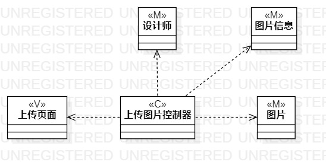
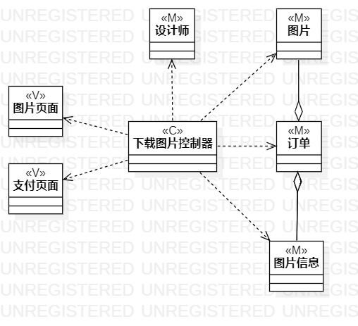

# 实验四五：类建模

## 一、实验目标

1. 掌握类建模方法；
2. 了解MVC或你熟悉的设计模式；
3. 掌握类图的画法。（Class Diagram）

## 二、实验内容

1. 基于MVC模式设计类；
2. 设计类的关系；
3. 画出类图。

## 三、实验步骤

1. 修改用例规约和活动图
2. 分析寻找类
3. 画用例“上传图片”的类图
4. 画用例“下载图片”的类图

## 四、实验结果

  
图1.“上传图片”的类图

  
图2.“下载图片”的类图

