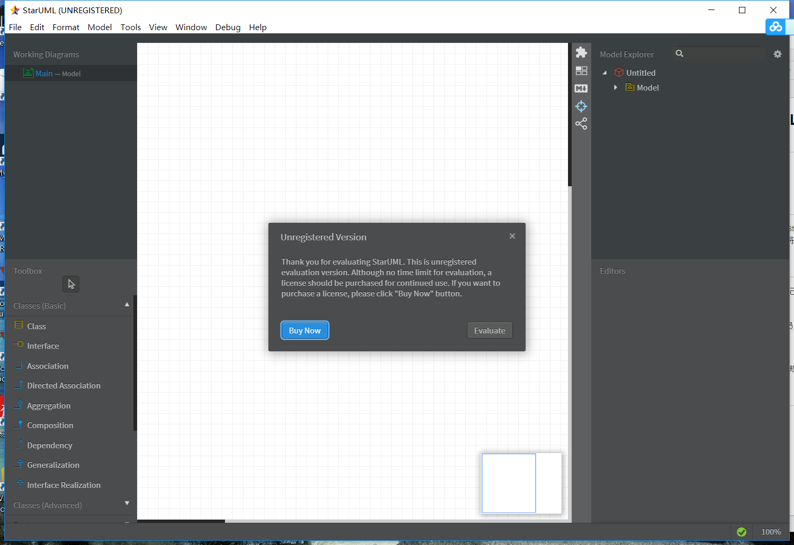

# 实验一：UML建模工具

## 1. 实验目标

- 加强github的使用   
- 掌握建模工具的使用

## 2. 实验内容

- 下载并安装建模工具StarUML
- 确定个人建模选题，将选题填写在Issues中

## 3. 实验步骤
-工具安装之后，打开并截图； 
-选题为疫情人员管理系统 
(1)增加人员功能：管理员保存人员信息 
(2)删除人员功能：管理员移除人员信息 

## 4. 实验结果
-图1：建模工具截图

 

-图2：用例图

