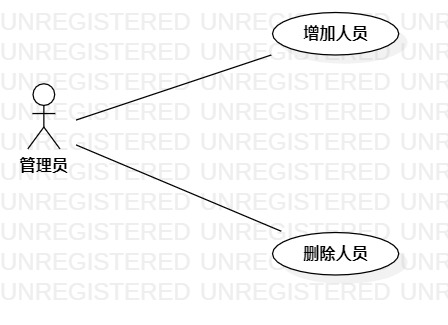

# 实验二：用例建模

## 1. 实验目标

- 加强github的使用   
- 掌握画用例图
- 掌握如何编写用例规约

## 2. 实验内容

### - 细化功能需求
### - 画出用例图
### - 编写用例规约

## 3. 实验步骤

- 首先在issue里提交自己的选题
- 创建用例图 
(1)参与者：管理员 
(2)添加用例: 增加人员，删除人员 
(3)建立关系

- 编写用例规约 
(1)编写增加人员用例规约
(2)编写删除人员用例规约

## 4. 实验结果

图1：疫情人员管理系统的用例图

## 表1：增加人员用例规约  

用例编号  | UC01 | 备注  
-|:-|-  
用例名称       | 增加人员     |   
前置条件  |   管理员登录   | *可选*   
后置条件  | 系统添加人员信息     | *可选*   
基本流程  | 1. 管理员点击增加人员按钮；  |*用例执行成功的步骤*    
~| 2. 系统显示信息表单页面；  |   
~| 3. 管理员输入需要增加的人员的信息，点击添加按钮； |  
~| 4. 系统查询人员信息，检查信息输入格式；  | 
~| 5. 系统保存人员信息。  |    
扩展流程  | 4.1 系统信息输入格式错误，**提示“信息格式有误”**；  |*用例执行失败*    
~| 4.2 系统检查发现需新增人员已存在，**提示“该人员已存在”**。  |  

## 表2：删除人员用例规约  

用例编号  | UC02 | 备注  
-|:-|-  
用例名称       | 删除人员     |   
前置条件  |   管理员登录   | *可选*   
后置条件  | 系统删除人员信息     | *可选*   
基本流程  | 1. 管理员点击删除人员按钮；  |*用例执行成功的步骤*    
~| 2. 系统显示信息表单页面；  |   
~| 3. 管理员输入需要删除的人员的信息，点击删除按钮。  |
~| 4. 系统查询人员信息，检查信息输入格式；  |
~| 5. 系统移除人员信息。  |     
扩展流程  | 4.1 系统信息输入格式错误，**提示“信息格式有误”**；  |*用例执行失败*    
~| 4.2 系统检查发现需删除人员不存在，**提示“该人员不存在”**。  |