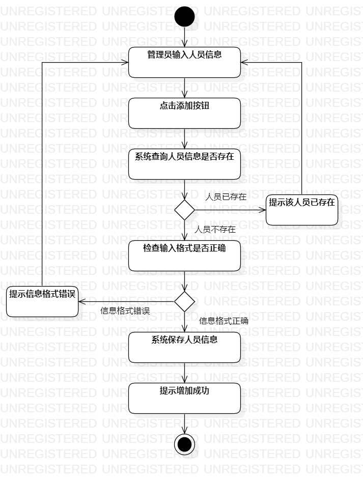

# 实验三：过程建模

## 1. 实验目标

- 掌握过程建模方法；   
- 掌握活动图的画法。

## 2. 实验内容

- 画出活动图
- 编写实验报告

## 3. 实验步骤

- 打开实验二的实验报告查看用例规约
- 创建添加人员的活动图 
(1)先绘制出起始节点和结束节点 
(2)添加活动: 管理员输入人员信息，点击添加按钮，系统查询人员信息是否存在 
(3)添加决策分支：人员存在，人员不存在 
(4)在存在的分支下添加活动：提示该人员已存在 
(5)在不存在的分支下添加活动:检查输入格式是否正确 
(6)添加决策分支：信息格式错误，信息格式正确 
(7)在信息格式错误的分支下添加活动：提示信息格式错误 
(8)在信息格式正确的分支下添加活动：系统保存人员信息，提示增加成功 
(9)建立各个节点、决策点和活动的关系 
(10)调整节点大小

- 创建删除人员的活动图 
(1)先绘制出起始节点和结束节点 
(2)添加活动: 管理员输入人员信息，点击删除按钮，系统查询人员信息是否存在 
(3)添加决策分支：人员存在，人员不存在 
(4)在人员不存在的分支下添加活动：提示该人员不存在 
(5)在人员存在的分支下添加活动:检查输入格式是否正确 
(6)添加决策分支：信息格式错误，信息格式正确 
(7)在格式错误的分支下添加活动：提示信息格式错误 
(8)在格式正确的分支下添加活动：系统移除人员信息，提示删除成功 
(9)建立各个结点、决策点和活动的关系 
(10)调整节点大小

## 4. 实验结果

图1：添加人员的活动图

图2：删除人员的活动图

