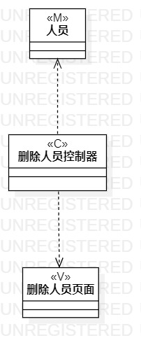

# 实验四：类建模

## 1. 实验目标

- 掌握类建模方法；   
- 了解MVC或你熟悉的设计模式；
- 掌握类图的画法。
- 理解类的五种关系；
- 掌握类之间的画法。

## 2. 实验内容

- 基于MVC模式设计类；
- 设计类的关系；
- 画出类图；
- 编写实验报告

## 3. 实验步骤

- 打开实验二的实验报告查看用例规约
- 添加人员的类图 
(1)新建人员类 
(2)新建增加人员控制器类 
(3)新建增加人员页面类 
(4)建立三个类之间的关系

- 删除人员的类图 
(1)新建人员类 
(2)新建删除人员控制器类 
(3)新建删除人员页面类 
(4)建立三个类之间的关系

## 4. 实验结果

图1：添加人员的类图

图2：删除人员的类图

