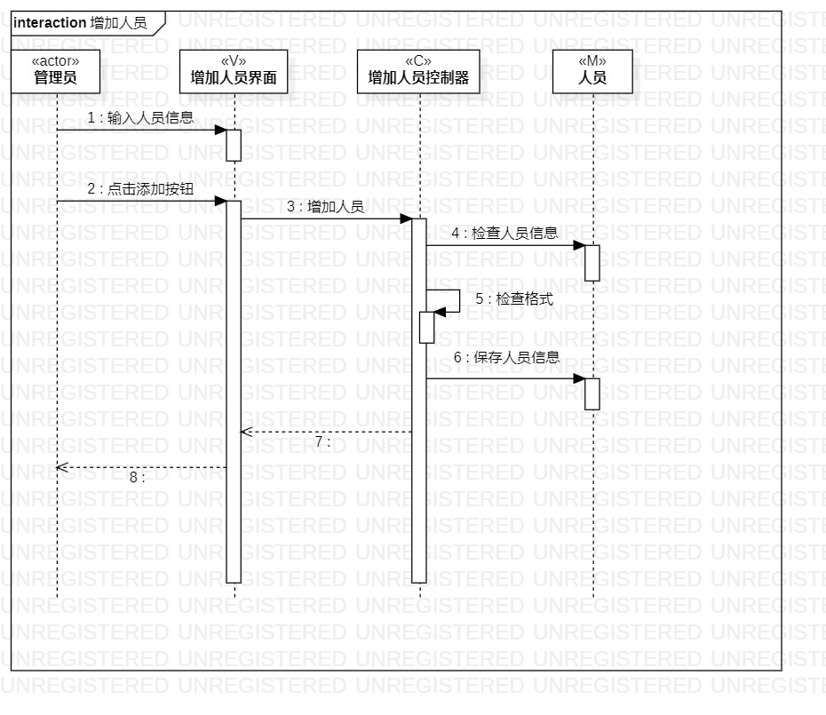
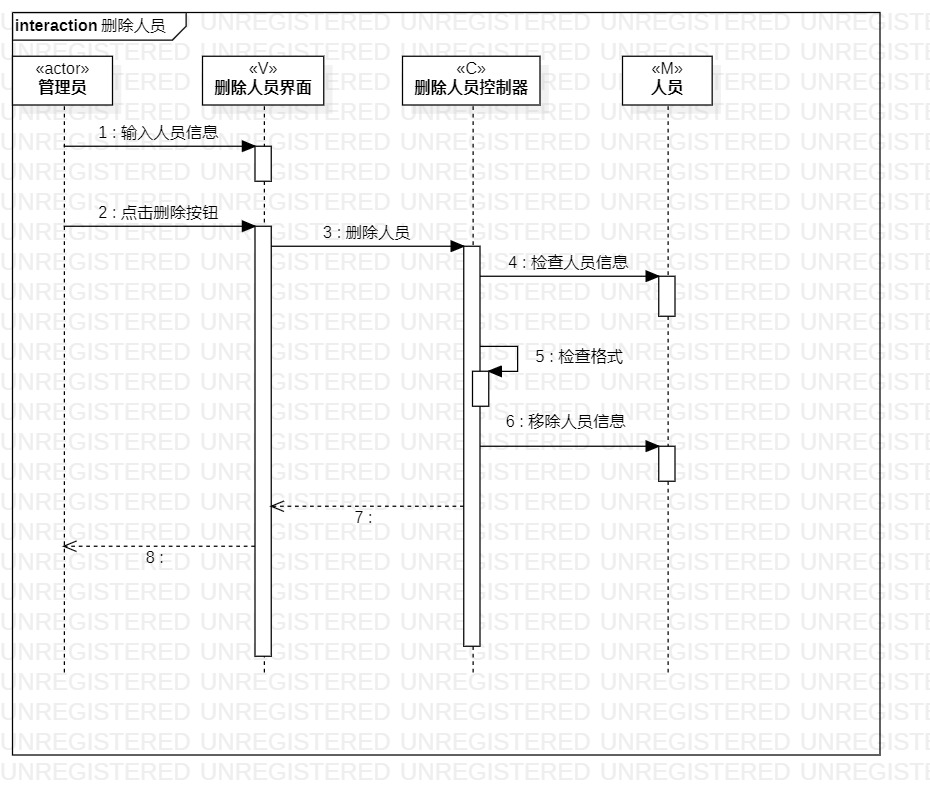

# 实验六：交互建模

## 1. 实验目标

- 理解系统交互；   
- 掌握UML顺序图的画法；
- 掌握对象交互的定义与建模方法。

## 2. 实验内容

- 根据用例模型和类模型，确定功能所涉及的系统对象；
- 在顺序图上发出参与者（对象）；
- 在顺序图上画出消息（交互）；
- 编写实验报告。

## 3. 实验步骤

- 打开前几次的实验报告查看用例、用例规约、活动图、类图
- 增加人员顺序图 
(1)新建管理员的生命线 
(2)新建增加人员界面的生命线 
(3)新建增加人员控制器的生命线 
(4)新建增加人员的生命线 
(5)绘制参与者与各个类之间的信息联系

- 删除人员顺序图 
(1)新建管理员的生命线 
(2)新建删除人员界面的生命线 
(3)新建删除人员控制器的生命线 
(4)新建删除人员的生命线 
(5)绘制参与者与各个类之间的信息联系

## 4. 实验结果

图1：增加人员顺序图

图2：删除人员顺序图

