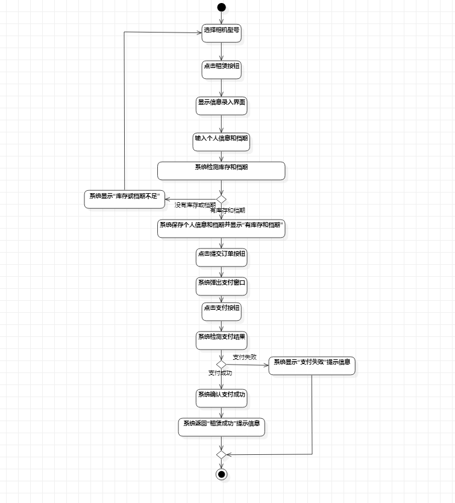
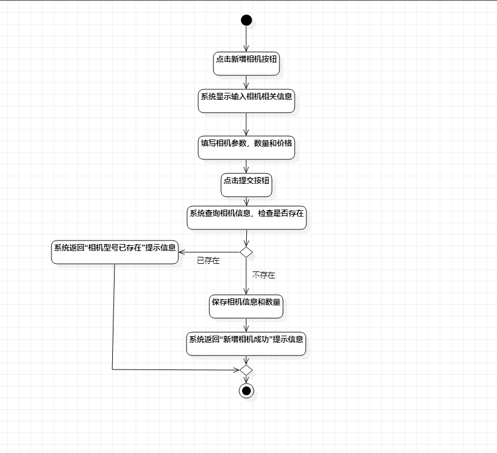
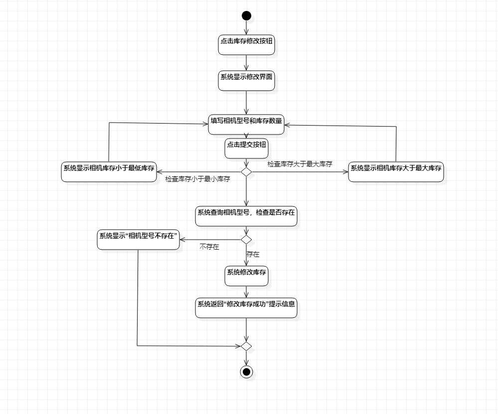

# 实验三：过程建模

## 一、实验目标

1.掌握过程建模方法；

2.掌握活动图(Activity Diagram)的画法。

## 二、实验内容

1.根据用例规约画出活动图；

2.编写实验报告。

##  三、实验步骤

1.添加开始（Initial）和结束结点（Final）；

2.根据实验2报告的用例规约添加活动（action）；

3.添加决策分支(Decision)；

4.添加合并节点(Merge)

5.用Control flow连接各部分；

6.另外两张重复上面操作；

## 四、实验结果

图1：租赁相机活动图

图2：新增相机活动图

图3：修改相机库存活动图
