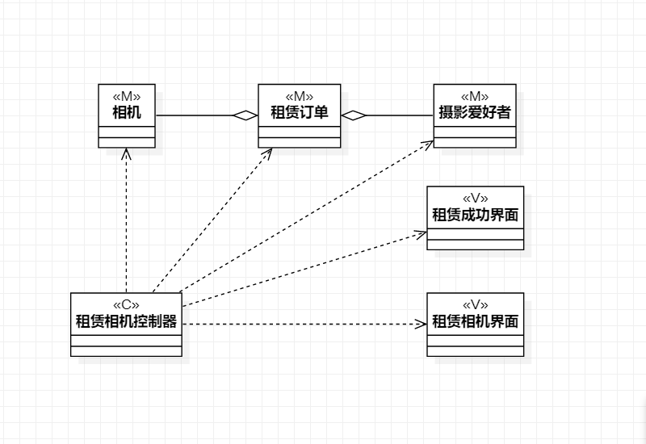
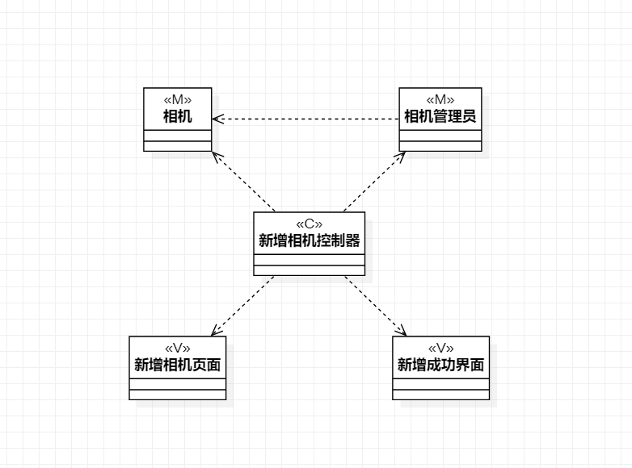
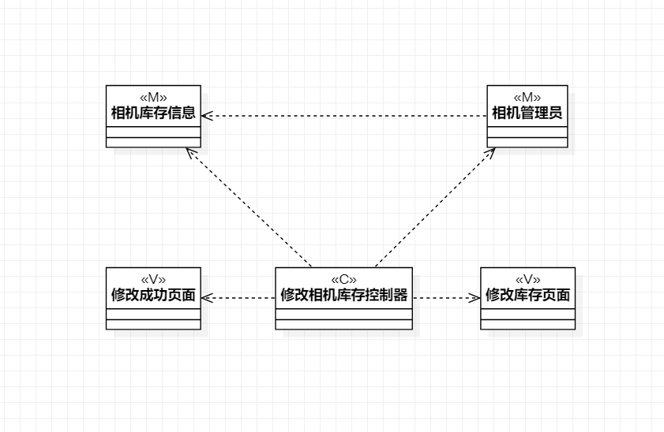

# 实验四五：类建模

## 一、实验目标

1. 掌握类建模方法  
2. 了解 MVC 或你熟悉的设计模式  
3. 掌握类图的画法  
4. 理解类的5种关系；
5. 掌握类之间关系的画法。（Class Diagram）
## 二、实验内容

1.基于MVC模式设计类；
2.设计类的关系；
3.画出类图；

## 三、实验步骤

1. 了解并学习MVC设计模式
2. 查看并修改实验二的用例规约
3. 分析用例的MVC三个模块
4. 确定类之间的关系
5. 绘制类图
6. 撰写实验报告

## 四、实验结果

  
图 1 ：租赁相机类图

  
图 2 ：新增相机类图

  
图 3 ：修改相机库存类图
