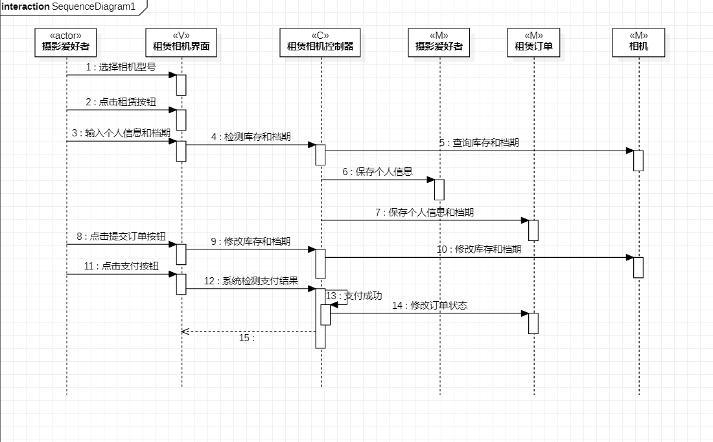
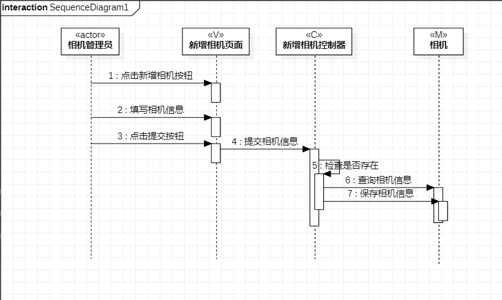
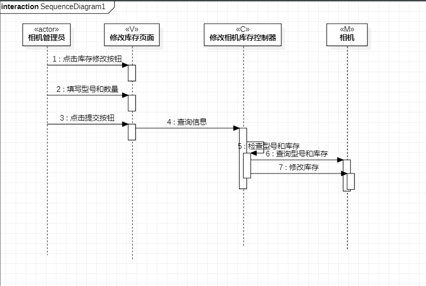

# 实验六：交互建模

## 一、实验目标

1. 理解系统交互。 

2. 掌握UML顺序图的画法。 

3. 掌握对象交互的定义与建模方法。 

## 二、实验内容

1. 根据用例规约找参与者。

2. 根据用例图和类图画出顺序图

2. 根据活动图画出消息的传递。   

## 三、实验步骤

1. 看视频了解顺序图中的对象、消息的概念和画法。

2. 根据用例图和类图确定参与者，添加参与者。  

3. 根据活动图确定消息，添加消息。

4. 根据实际情况检查顺序图并修改前面的实验。

## 四、实验结果

### 图一：相机租赁顺序图  
  

### 图二：新增相机顺序图  
  

### 图三：修改库存顺序图  

