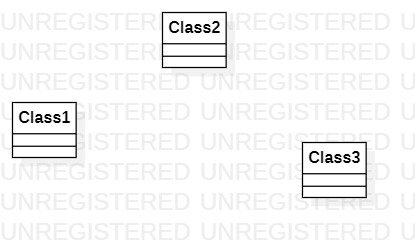

# 实验1

## 实验目标

1. 熟悉GitHub实验过程
2. 安装与使用staruml

## 实验内容
1. 安装GitHub并练习使用Git Bash
2. 安装StarUML并创建一个图

## 实验步骤

1. 安装GitHub和StarUML
2. fork项目到自己账号
3. clone项目到本地磁盘
4. 建立实验文档lab1.md和使用StarUML创建第一个UML图model1.jpg
5. 使用git上传本地文件
6. 在GitHub上对lab1.md进行完善，加入选题。
7. pullrequest提交实验报告

## 实验结果

## 实验选题

选题名称：

     小卖部库存管理系统
功能描述：

     1.商品入库

     2.商品出库

     3.查询库存

             
              
