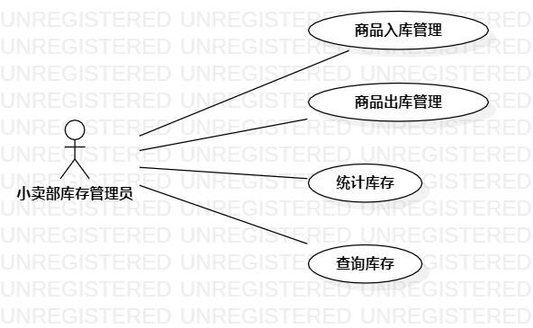

# 实验二 用例建模

## 实验目标

1. 学会使用staruml进行用例建模
2. 使用Markdown写使用报告

## 实验内容
1. 创建选题的用例图
2. 编写实验报告文档

## 实验步骤

1. 使用staruml，建立用例图lab2_UseCaseDiagram.jpg
2. push到自己账户下
3. 新建实验二文档lab2.md并编写
4. pullrequest提交实验二报告

## 实验结果

  
图1： 小卖部库存管理系统的用例图
