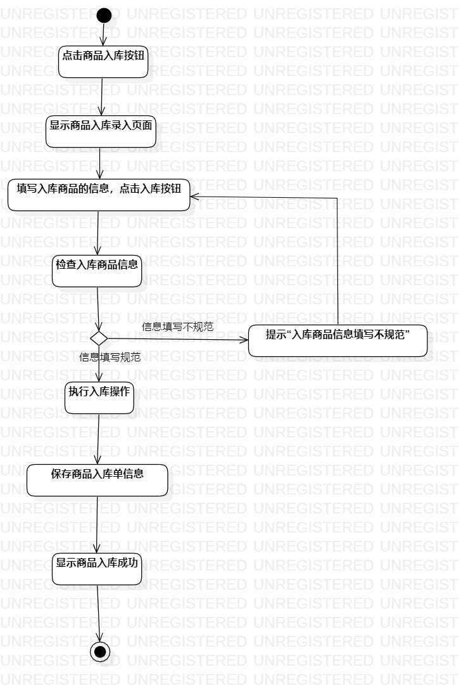
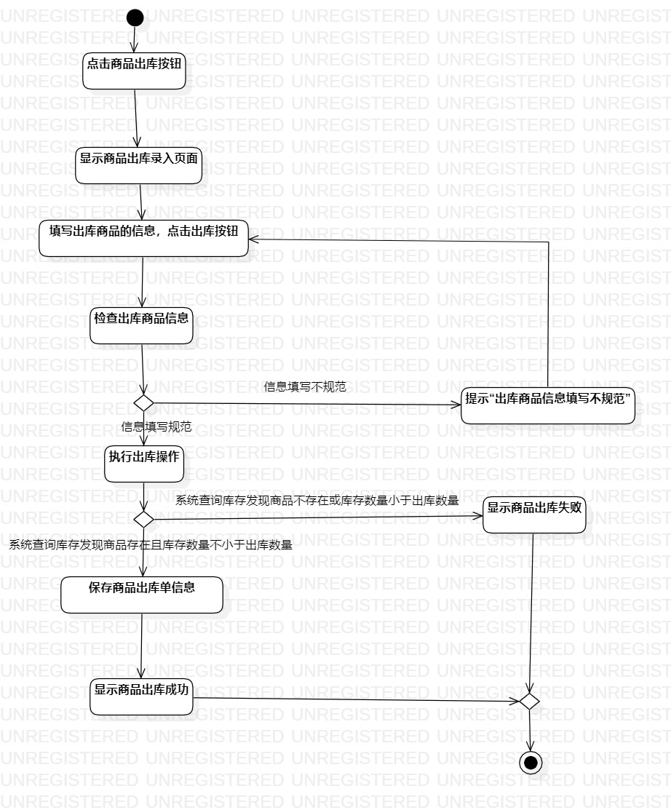

# 实验三 过程建模

## 一. 实验目标
1. 掌握过程建模方法；
2. 掌握活动图的画法。

## 二. 实验内容
1. 根据实验二中的用例规约创建活动图

## 三. 实验步骤

1. 根据实验二的用例规约创建活动图，包括商品入库的活动图、商品出库的活动图、查询库存的活动图；
2. 在各个活动图中创建开始Initial和结束final；
3. 根据用例流程，分别创建活动Action；
4. 若遇到有扩展流程时，创建分支Decision同时标明分支条件；根据需要，创建合并Merge；
5. 根据分支条件，继续创建活动Action；
6. 根据执行关系，建立活动间的线条Control Flow；
7. 将三个活动图以图片形式生成。

## 四. 实验结果

  
图1： 商品入库的活动图

  
图2： 商品出库的活动图

  
图3： 查询库存的活动图
