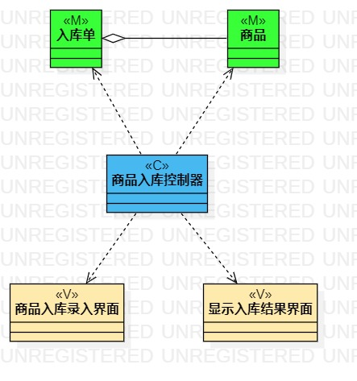
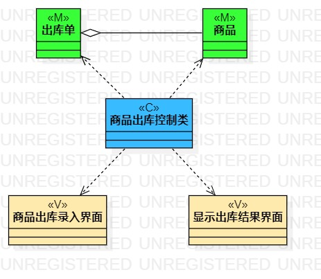
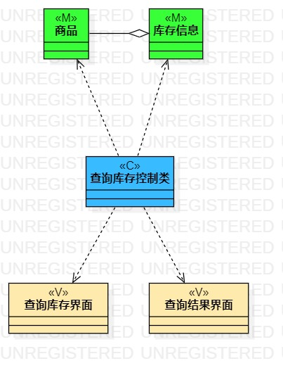

# 实验四 类建模
# 实验五 高级类建模

## 一. 实验目标
1. 掌握类建模方法；  
2. 了解MVC或你熟悉的设计模式；  
3. 掌握类图的画法；（Class Diagram）  
4. 理解类的5种关系；  
5. 掌握类之间关系的画法。   

## 二. 实验内容
根据用例规约绘制类图：
1. 商品入库类图  
2. 商品出库类图  
3. 查询库存类图  

## 三. 实验步骤

1. 在staruml中分别建立商品入库类图、商品出库类图、查询库存类图；  
2. 在实验二中用例规约的基本流程和扩展流程中寻找类，绘制类图；  
3. 根据系统操作设计业务服务类；  
4. 根据类之间的关系完成连线。

## 四. 实验笔记
1. MVC设计模式：  
  （1）M：模型、实体、数据  
  （2）V：视图、界面  
  （3）C：控制器、服务类、系统  
2. 类的5种关系：  
  （1）依赖（虚线箭头）  
  （2）关联（实线）  
  （3）聚合（实线空心菱形箭头）  
  （4）组合（实线实心菱形箭头）  
  （5）继承（实线实心三角形箭头）  
## 五. 实验结果  

  
图1： 商品入库类图

  
图2： 商品出库类图

   
图3： 查询库存类图
