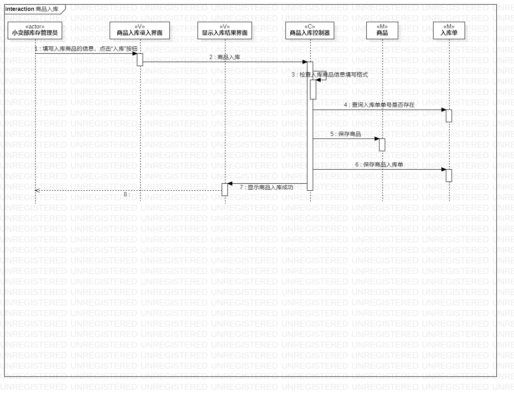
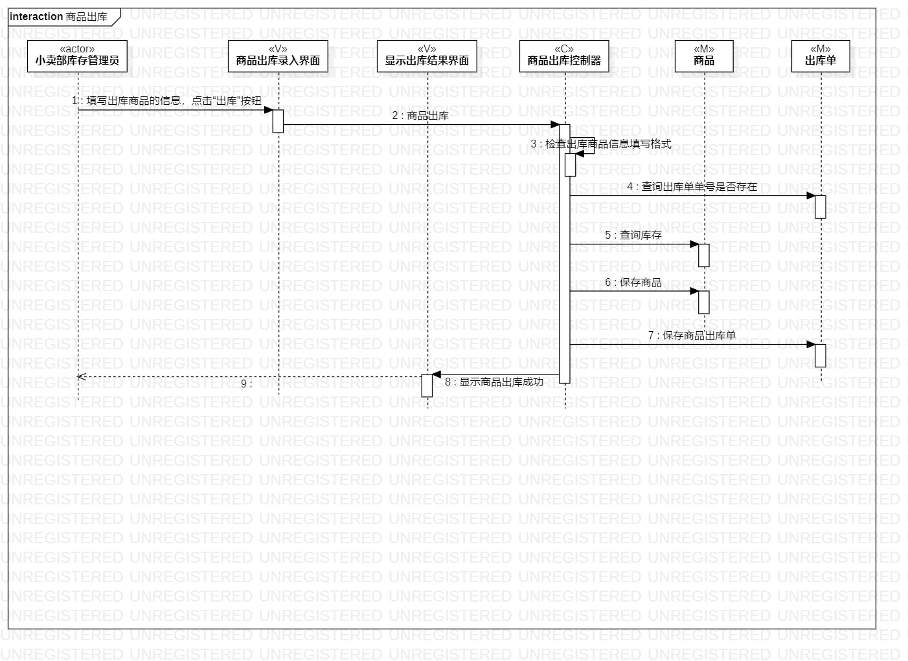
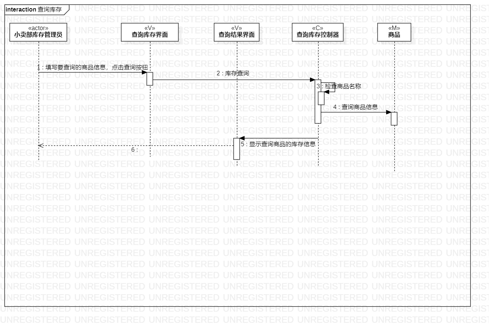

# 实验六 交互建模

## 一. 实验目标
1. 理解系统交互；  
2. 掌握UML顺序图的画法；  
3. 掌握对象交互的定义与建模方法。  

## 二. 实验内容
1. 根据用例模型和类模型，确定功能所涉及的系统对象；  
2. 在顺序图上画出参与者（对象）；
3. 在顺序图上画出消息（交互）。  

## 三. 实验步骤  
1. 在staruml中分别建立商品入库顺序图、商品出库顺序图、查询库存顺序图；  
2. 根据实验四&五类建模确定对象，添加lifeline；  
3. 根据实验二用例规约和实验三活动图确定消息和返回消息，添加message和reply message。  

## 四. 实验结果  

  
图1： 商品入库的顺序图

  
图2： 商品出库的顺序图

   
图3： 查询库存的顺序图
