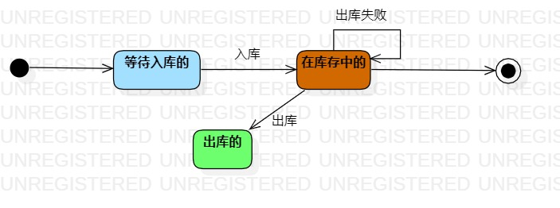

# 实验七 状态建模

## 一. 实验目标
1. 掌握对象状态建模。

## 二. 实验内容
1. 根据用例图、用例规约、活动图、类图、顺序图，确定关键对象；
2. 画出状态图。  

## 三. 实验步骤  
1. 根据前面实验的用例图、用例规约、活动图、类图以及顺序图，确定关键对象为商品，并创建商品的状态图；
2. 找出对象商品的相关状态，即  
（1）等待入库的；  
（2）在库存中的；  
（3）出库的。  
3. 添加“Initial State”、“Final State”、“Simple State”；  
4. 确定各状态之间的转换；  
5. 完成状态图。  

## 四. 实验结果  

  
图1： 商品的状态图

