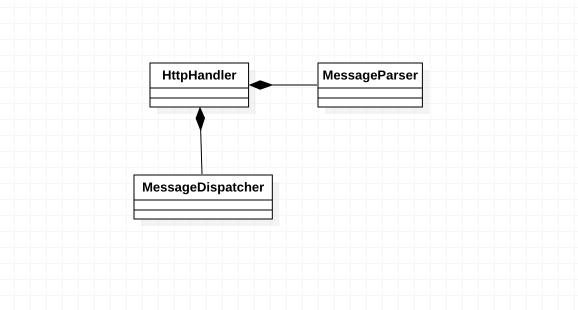
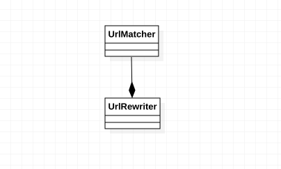

# 实验四、五：类建模

## 一、实验目标

1. 掌握类建模方法；
2. 了解MVC或你熟悉的设计模式；
3. 了解类图（Class Diagram）画法。

## 二、实验内容

1. 采用Strategy设计模式来实现组件松耦合；
2. 设计类的关系；
3. 画出类图。

## 三、实验结果

### 1. 获取页面类图

采用Strategy模式，使用Composition完成解析器和分发器的解耦，解析器和分发器可以通过继承更好的拓展。

### 2. 重写URL类图

设计策略如上，

