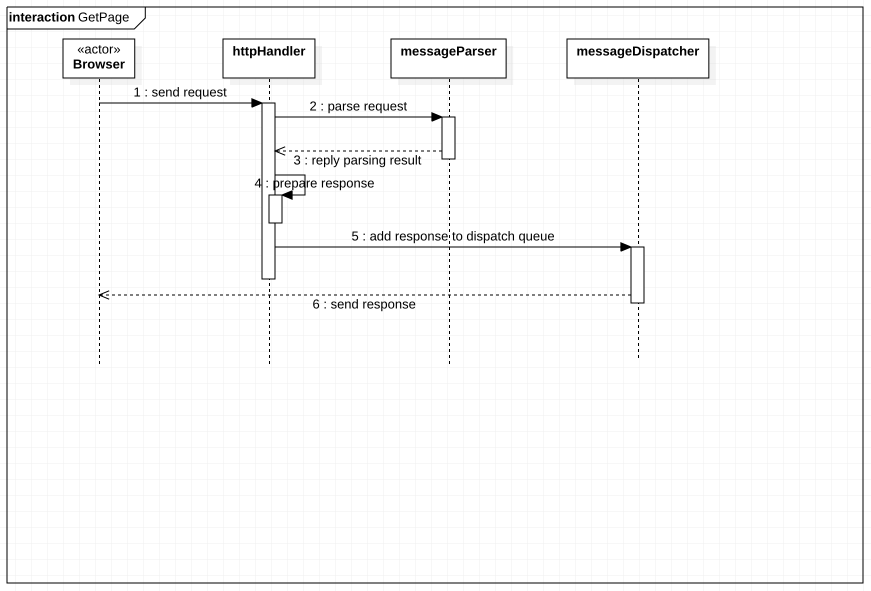
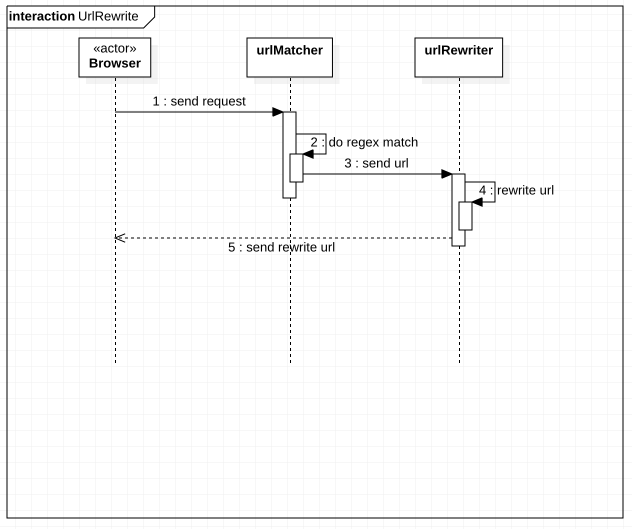

# 实验六：交互建模

## 一、实验目标

1. 理解系统交互
2. 掌握UML顺序图的画法
3. 掌握对象交互的定义与建模方法

## 二、实验内容

1. 根据用例模型和类模型，确定功能所涉及的系统对象；
2. 在顺序图上画出参与者（Object）；
3. 在顺序图上画出消息（Interaction）。

## 三、实验步骤

1. 在StarUML上创建顺序图
2. 根据用例规约和类图，画出1+N个参与者

## 四、实验结果

### 1. 获取页面顺序图

### 2. 重写URL顺序图
