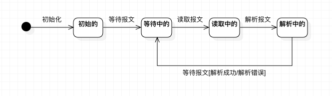

# 实验七：状态建模

## 一、实验目标

1. 掌握对象状态建模（Statechart）

## 二、实验内容

1. 根据用例图、活动图、类图、时序图来绘画状态图;
2. 编写实验报告文档。

## 三、实验步骤

1. 在StarUML中创建状态图(StateChartDiagram);
2. 分析MessageParser在整个生命周期内的状态；
3. 确定状态：初始的、等待中的、读取中的、解析中的；
4. 完成状态图绘制；
5. 完成报告编写。

## 四、实验结果

### 1. 报文解析器状态图

