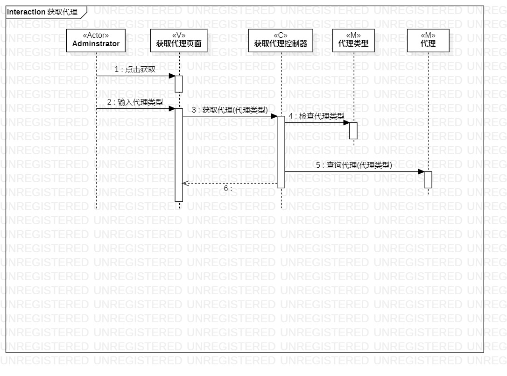

# 实验六：交互建模

## 实验目标

1.  理解系统交互；
2.  掌握UML顺序图的画法；
3.  掌握对象交互的定义与建模方法。

## 实验内容

1.  根据用例模型和类模型，确定功能所涉及的系统对象；
2.  在顺序图上画出参与者（对象）；
3.  在顺序图上画出消息（交互）。

## 实验步骤

1. 新建顺序图，以用例名称命名顺序图，每个用例对应一个顺序图
2. 从之前的用例图中找到顺序图的第一个参与者Administrator
3. 根据类图确定其他参与者，将类图中代表MVC的类都作为参与者添加到顺序图中
    1. **Interaction 添加代理**的其他参与者为：添加代理页面（V），添加代理控制器（C），代理（M），代理类型（M）
    2. **Interaction 获取代理**的其他参与者为：获取代理页面（V），获取代理控制器（C），代理类型（M），代理（M）
4. 从活动图找到操作步骤，画出参与者之间的消息

## 实验结果

  
图1：添加代理的顺序图

  
图2：获取代理的顺序图

## 实验笔记

1.  顺序图的构成

    1.  参与者，矩形表示，常见命名方式

        ```
        name				//只写参与者
        name:class name		//写参与者和所属的类
        :class name			//只写参与者所属的类
        ```

    2.  生命线，虚线表示

    3.  事件、信号与消息：带箭头的线，根据情况使用不同的线

    4.  存活条，生命线上的矩形表示

2.  顺序图的“时间顺序”：仅表示前后顺序，不表示时间跨度

3.  顺序图的消息——对象交互/行为

4.  参与者的存活条/激活条

5.  各种消息类型对应的箭头，常见的有同步消息、异步消息和返回消息